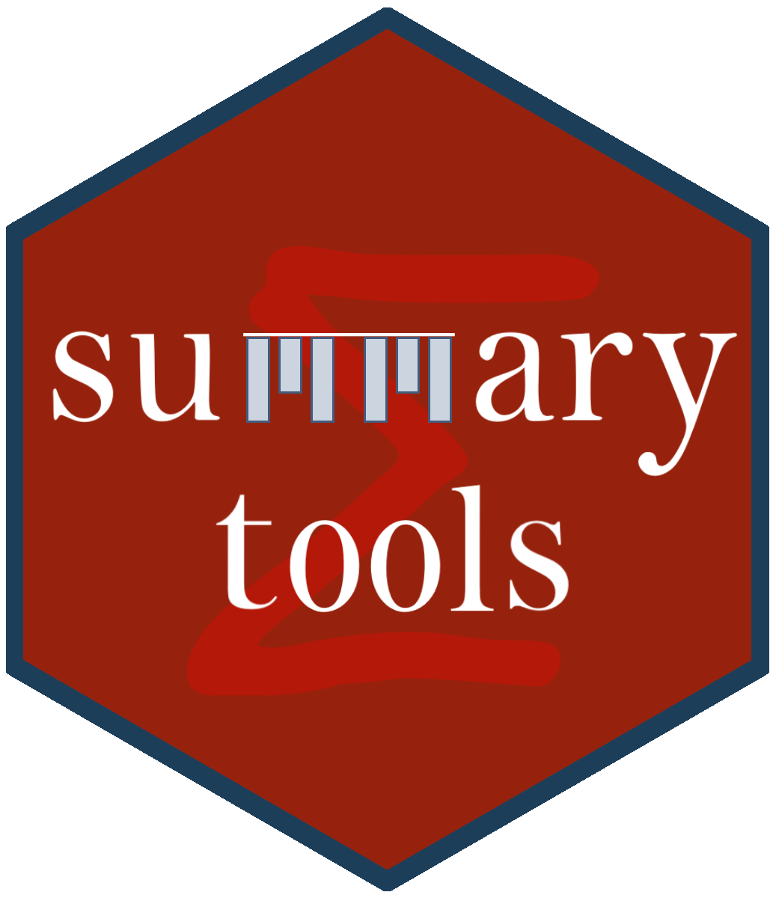

<!-- badges -->

[](https://cran.r-project.org/package=summarytools)
[](http://cran.rstudio.com/web/packages/summarytools/index.html)
[](http://cran.rstudio.com/web/packages/summarytools/index.html)
<span class="badge-paypal"><a href="https://www.paypal.com/cgi-bin/webscr?cmd=_donations&business=HMN3QJR7UMT7S&item_name=Help+scientists,+data+scientists+and+analysts+around+the+globe&currency_code=CAD&source=url" title="Donate to this project using Paypal"></a></span>

```{r knitr-setup, include=FALSE}
library(knitr)
opts_chunk$set(echo = TRUE, results = 'asis', class.output = "small")
library(summarytools)
st_options(plain.ascii = FALSE,
           style = "rmarkdown",
           footnote = NA,
           subtitle.emphasis = FALSE,
           dfSummary.silent = TRUE,
           dfSummary.style = "grid",
           descr.silent = TRUE)
library(kableExtra)
```


# Summarytools 1.1 is out! {width=100px, height=125px}

**summarytools** is a an [*R*](https://www.r-project.org) package for data
cleaning, exploring, and simple reporting. The package was developed with the
following objectives in mind:

-   Provide a coherent set of easy-to-use descriptive functions akin to
    those included in commercial statistical software suites such
    as SAS, SPSS, and Stata 
 - Offer flexibility in terms of output format & content  
 - Integrate well with commonly used software & tools for reporting
   (the [RStudio](https://posit.co/products/open-source/rstudio/) IDE,
   [Rmarkdown](https://rmarkdown.rstudio.com/),
   [Quarto](https://quarto.org/docs/get-started/), and 
    [knitr](https://yihui.org/knitr/)) while also allowing for standalone,
    simple report generation using any R interface

On a more personal level, I simply wish to share with the R community and the
scientific community at large the functions I first developed for myself, and
soon realized would benefit others who are facing similar challenges when 
dealing daily with (often messy) data.

## Please Support *summarytools*' Development

If **summarytools** brings value to your work, please consider making a
donation. I put in a huge amount of time on this project, and got loads of
positive feedback, but very few (less than 20) donations. No matter the amount,
I always appreciate the gesture. Plus, I'll add your name to the list of 
supporters [further below](#supporters).

<a href="https://www.paypal.com/cgi-bin/webscr?cmd=_donations&business=HMN3QJR7UMT7S&item_name=Help+scientists,+data+scientists+and+analysts+around+the+globe&currency_code=CAD&source=url"></a>

# Package Documentation

The bulk of the technical documentation can now be found in the following
vignettes:

[**Introduction to summarytools**](https://htmlpreview.github.io/?https://github.com/dcomtois/summarytools/blob/master/doc/introduction.html)  |  [CRAN version](https://cran.r-project.org/package=summarytools/vignettes/introduction.html)  
[**Summarytools in R Markdown**](https://htmlpreview.github.io/?https://github.com/dcomtois/summarytools/blob/master/doc/rmarkdown.html)  |  [CRAN Version](https://cran.r-project.org/packages=summarytools/vignettes/rmarkdown.html)  
[**PDF Manual**](https://cran.r-project.org/web/packages/summarytools/summarytools.pdf) (automatically generated by CRAN)

# Installing summarytools

### Required Software

Additional software is used by **summarytools** for fine-tuning graphics as well
as offering interactive functionality. If you are installing **summarytools**
for the first time, click on the relevant link to get OS-specific instructions.
On Windows, no additional software is required.

<a href="#required-mac-os">Mac OS X</a>  
<a href="#required-debian">Ubuntu / Debian / Mint</a>  
<a href="#required--older-ubuntu">Older Ubuntu (14 and 16)</a>  
<a href="#required-fedora">Fedora / Red Hat / CentOS</a>  
<a href="#required-solaris">Solaris</a>

### Installing From GitHub

This method has the advantage of benefiting from minor fixes and improvements
that are added between CRAN releases. Its main drawback is that you won't be
noticed when a new version is available. You can either check this page from
time to time, or best, use a package that checks for package updates on various
repositories, such as [dtupdate](https://github.com/hrbrmstr/dtupdate) and
[Drat](https://dirk.eddelbuettel.com/code/drat.html).

```{r, eval=FALSE}
install.packages("remotes")        # Using devtools is also possible
library(remotes)
install_github("rapporter/pander") # Strongly recommended
install_github("dcomtois/summarytools", build_vignettes = TRUE)
```

### Installing From CRAN

CRAN versions are stable but are not updated as often as the GitHub versions. On
the plus side, they can be easier to install on some systems.

```{r, eval=FALSE}
install.packages("summarytools")
```

# Latest Changes

- Version 1.1 introduces a few significant improvements, aside from the bug
  fixes.

  - 

-   In `dfSummary()`:

    -   It is now possible to control which statistics to show in the *Freqs /
        Values* column (see `help("st_options", "summarytools")` for examples)  
    -   In *html* outputs, tables are better aligned horizontally
        (categories \>\> counts \>\> charts); if misalignment occurs, adjusting
        `graph.magnif` should resolve it
    -   List-type columns and `Inf` values are handled properly

-   In `descr()` and `ctable()` several display glitches were corrected

-   Selected heading elements can be totally omitted on an individual basis

-   Improved functionality for customized terms / translations

For more details, see `vignette("introduction", "summarytools")` as well as
`news(package = "summarytools")`.

# Additional Software Installations

### <a id="required-mac-os"></a>Required Software on Mac OS

[**Magick++**](https://imagemagick.org/Magick++/)

Open a terminal window and enter the following:

`brew install imagemagick@6`

If you do not have **brew** installed, simply enter this command in the
terminal:

`/usr/bin/ruby -e "$(curl -fsSL https://raw.githubusercontent.com/Homebrew/install/master/install)"`

[**XQuartz**](https://www.xquartz.org/)

If you're using Mac OS X version 10.8 (Mountain Lion) or more recent versions,
you'll need to download the *.dmg* image from
[xquartz.org](https://www.xquartz.org/) and add it to your Applications folder.

<a href="#installing-from-github">Back to installation instructions</a>

### <a id="required-debian"></a>Required Software for Debian / Ubuntu / Linux Mint

[**Magick++**](https://imagemagick.org/Magick++/)  
`sudo apt install libmagick++-dev`

<a href="#installing-from-github">Back to installation instructions</a>

### <a id="required-older-ubuntu"></a>Required Software for Older Ubuntu Versions

This applies only if you are using Ubuntu Trusty (14.04) or Xenial (16.04).

[**Magick++**](https://imagemagick.org/Magick++/)

    sudo add-apt-repository -y ppa:opencpu/imagemagick
    sudo apt-get update
    sudo apt-get install -y libmagick++-dev

<a href="#installing-from-github">Back to installation instructions</a>

### <a id="required-fedora"></a>Required Software for Fedora / Red Had / CentOS

[**Magick++**](https://imagemagick.org/Magick++/)  
`sudo yum install ImageMagick-c++-devel`

<a href="#installing-from-github">Back to installation instructions</a>

### <a id="required-solaris"></a>Required Software for Solaris

[**Magick++**](https://imagemagick.org/Magick++/)

    pkgadd -d http://get.opencsw.org/now
    /opt/csw/bin/pkgutil -U
    /opt/csw/bin/pkgutil -y -i imagemagick 
    /usr/sbin/pkgchk -L CSWimagemagick

<a href="#installing-from-github">Back to installation instructions</a>

# <a id="supporters"></a>Supporters

A big thanks to the following people who made donations:

-   Ashirwad Barnwal  
-   David Thomas  
-   Peter Nilsson  
-   Ross Dunne  
-   Igor Rubets  
-   Joerg Sahlmann
-   Mark Friedman
-   Roger Hilfiker
-   Stefano Lav

**summarytools** is the result of **many** hours of work. If you find the
package brings value to your work, please take a moment to make a small
donation now.

<a href="https://www.paypal.com/cgi-bin/webscr?cmd=_donations&business=HMN3QJR7UMT7S&item_name=Help+scientists,+data+scientists+and+analysts+around+the+globe&currency_code=CAD&source=url"></a>

The package comes with no guarantees. It is a work in progress and feedback is
always welcome. Please open an [issue on
GitHub](https://github.com/dcomtois/summarytools/issues) if you find a bug or
wish to submit a feature request.

<a href="#top">Back to top</a>
