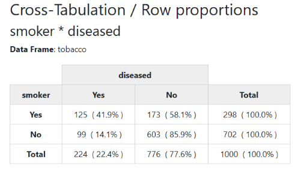
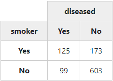
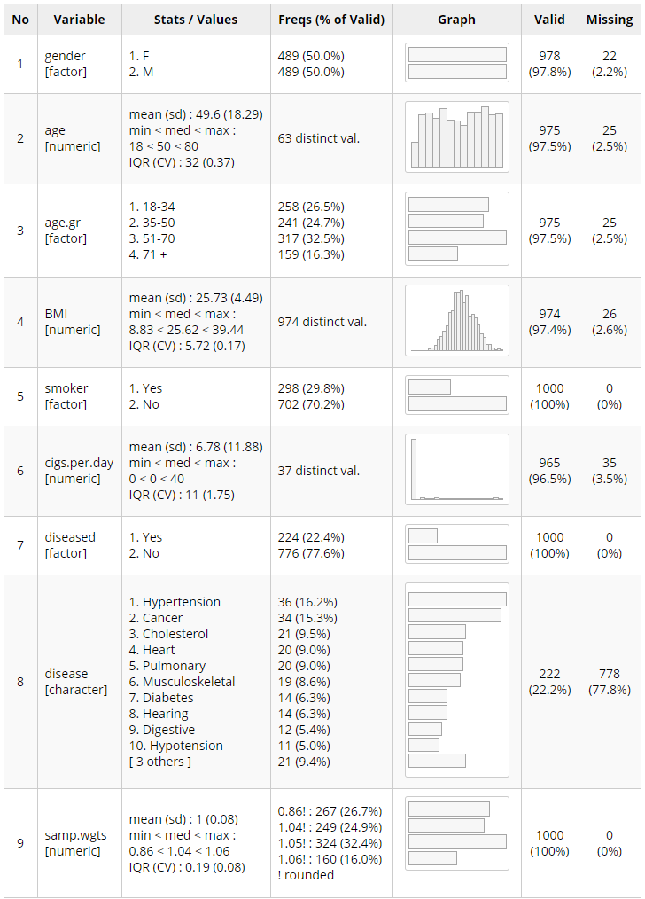

# [summarytools: An *R* Package For Descriptive Statistics](https://github.com/dcomtois/summarytools)

[](https://cran.r-project.org/package=summarytools)
[](http://cran.rstudio.com/web/packages/summarytools/index.html)
[](http://cran.rstudio.com/web/packages/summarytools/index.html)
[](http://www.rdocumentation.org/packages/summarytools)

The following vignettes complement this page:

[Recommendations for Using summarytools With
Rmarkdown](https://htmlpreview.github.io/?https://github.com/dcomtois/summarytools/blob/master/doc/Recommendations-rmarkdown.htm)  
[Changes Introduced in
Summarytools 0.9.0](https://htmlpreview.github.io/?https://github.com/dcomtois/summarytools/blob/master/doc/New-in-Version-0-9.htm)

# What is summarytools?

**summarytools** is an [R](http://r-project.org) package providing tools
to *neatly and quickly summarize data*. It can also make *R* a little
easier to learn and to use, especially for data cleaning and preliminary
analysis. Four functions are at the heart of the package:

  - `freq()` : **frequency tables** with proportions, cumulative
    proportions and missing data information
  - `ctable()` : **cross-tabulations** between two factors or any
    discrete data, with total, rows or columns proportions, as well as
    marginal totals
  - `descr()` : **descriptive (univariate) statistics** for numerical
    data
  - `dfSummary()` : Extensive **data frame summaries** that facilitate
    data cleaning and firsthand evaluation

An emphasis has been put on both *what* and *how* results are presented,
so that the package can serve both as an exploration *and* reporting
tool, used on its own for minimal reports, or with other sets of tools
such as [rmarkdown](http://rmarkdown.rstudio.com/), and
[knitr](https://yihui.name/knitr/).

**Building on the strengths of
[pander](https://github.com/Rapporter/pander) and
[htmltools](https://CRAN.R-project.org/package=htmltools)**, the outputs
produced by **summarytools** can be:

  - Displayed in plain text in the *R* console (default behaviour)
  - Used in *Rmarkdown* documents and *knitted* along with other text
    and *R* output
  - Written to *html* files that fire up in
    [*RStudio*](http://www.rstudio.com/)’s Viewer pane or in your
    default browser
  - Written to plain or *Rmarkdown* text files

Some users have requested Excel or *csv* exportation capabilities; these
will surely show up in an upcoming release.

It is also possible to include **summarytools**’ functions in *Shiny
apps*. Notably,
[radiant](https://cran.r-project.org/web/packages/radiant/index.html), a
Shiny-based package for business analytics, uses `dfSummary()` to
describe imported data frames.

### Latest Improvements

Versions 0.8.9 (which was only released on GitHub) and 0.9.0 brought
*many* changes and improvements to **summarytools**. This
[document](http://htmlpreview.github.io/?https://github.com/dcomtois/summarytools/blob/master/doc/New-in-Version-0-9.htm)
gives a detailed description of all the changes, but a summary can also
be found [at the end of the present page](#latest-changes).

# How to install

### From GitHub - version 0.9.0 (Recommended)

There have been quite a few changes since 0.8.8. I recommend you give a
try to this newer version. I’ve done some rather extensive testing, and
I believe it is as much stable as 0.8.8 now, with a lot of additional
features and improvements. The changes are also well documented.
Feedback is most welcome.

**[Magick++](https://imagemagick.org/Magick++/) Dependancy on Linux and
Mac OS**

    Before proceeding, you must install Magick++
    
     - deb: 'libmagick++-dev' (Debian, Ubuntu)
     - rpm: 'ImageMagick-c++-devel' (Fedora, CentOS, RHEL)
     - csw: 'imagemagick_dev' (Solaris)
    
    On MacOS it is recommended to use install ImageMagick-6 from homebrew
    with extra support for fontconfig and rsvg rendering:
       brew reinstall imagemagick@6 --with-fontconfig --with-librsvg
    
    For older Ubuntu versions Trusty (14.04) and Xenial (16.04) use our PPA:
       sudo add-apt-repository -y ppa:opencpu/imagemagick
       sudo apt-get update
       sudo apt-get install -y libmagick++-dev

…and after this is done:

``` r
install.packages("devtools")
library(devtools)
install_github("rapporter/pander") # Necessary for optimal results!
install_github("dcomtois/summarytools")
```

### From CRAN - version 0.8.8

This version is rather far behind 0.9.0, but if you don’t feel like
trying new features, just install it with `install.packages()`:

``` r
install.packages("summarytools")

The official documentation can be found
[here](http://cran.r-project.org/web/packages/summarytools/).
```

# The Four Core Functions

## 1 - freq() : Frequency Tables

The `freq()` function generates a table of frequencies with counts and
proportions. Since GitHub uses *markdown* rendering, we’ve set the
`style` argument to “rmarkdown”; **knitr** takes care of converting the
generated markup characters into actual formatting.

``` r
library(summarytools)
freq(iris$Species, style = "rmarkdown")
```

### Frequencies

**iris$Species**  
**Type:**
Factor

|                | Freq | % Valid | % Valid Cum. | % Total | % Total Cum. |
| -------------: | ---: | ------: | -----------: | ------: | -----------: |
|     **setosa** |   50 |   33.33 |        33.33 |   33.33 |        33.33 |
| **versicolor** |   50 |   33.33 |        66.67 |   33.33 |        66.67 |
|  **virginica** |   50 |   33.33 |       100.00 |   33.33 |       100.00 |
|     **\<NA\>** |    0 |         |              |    0.00 |       100.00 |
|      **Total** |  150 |  100.00 |       100.00 |  100.00 |       100.00 |

If we do not worry about missing data, we can set `report.nas =
FALSE`:

``` r
freq(iris$Species, report.nas = FALSE, style = "rmarkdown", headings = FALSE)
```

|                | Freq |      % | % Cum. |
| -------------: | ---: | -----: | -----: |
|     **setosa** |   50 |  33.33 |  33.33 |
| **versicolor** |   50 |  33.33 |  66.67 |
|  **virginica** |   50 |  33.33 | 100.00 |
|      **Total** |  150 | 100.00 | 100.00 |

We can simplify the results further and omit the *Totals* row by
specifying `totals = FALSE`.

To get familiar with the output styles, try different values for `style`
and see how this affects the results in *R*’s console.

## 2 - ctable() : Cross-Tabulations

We’ll now use a sample data frame called *tobacco*, which is included in
**summarytools**. We want to cross-tabulate two categorical variables:
`smoker` and `diseased`. By default, `ctable()` shows row proportions.

Since *markdown* does not support multiline headings, we’ll show a
rendered *html* version of the results:

``` r
print(ctable(tobacco$smoker, tobacco$diseased), method = "render")
```



Note that we have to set the **knitr** chunk option `results` to “asis”
for the results to appear as they should.

It is possible to display *column*, *total*, or no proportions at all,
like in the next example. We will also omit the marginal totals to have
a simple “2 x 2” table.

To show column or total proportions, use `prop = "c"` or `prop = "t"`,
respectively.

``` r
with(tobacco, 
     print(ctable(smoker, diseased, prop = 'n', totals = FALSE),
     headings = FALSE, method = "render"))
```



## 3 - descr() : Descriptive Univariate Stats

The `descr()` function generates common central tendency statistics and
measures of dispersion for numerical data. It can handle single vectors
as well as data frames, in which case it just ignores non-numerical
columns (and displays a message to that effect).

``` r
descr(iris, style = "rmarkdown")
```

    ## Non-numerical variable(s) ignored: Species

### Descriptive Statistics

**iris**  
**N:**
150

|                 | Petal.Length | Petal.Width | Sepal.Length | Sepal.Width |
| --------------: | -----------: | ----------: | -----------: | ----------: |
|        **Mean** |         3.76 |        1.20 |         5.84 |        3.06 |
|    **Std.Dev.** |         1.77 |        0.76 |         0.83 |        0.44 |
|         **Min** |         1.00 |        0.10 |         4.30 |        2.00 |
|          **Q1** |         1.60 |        0.30 |         5.10 |        2.80 |
|      **Median** |         4.35 |        1.30 |         5.80 |        3.00 |
|          **Q3** |         5.10 |        1.80 |         6.40 |        3.30 |
|         **Max** |         6.90 |        2.50 |         7.90 |        4.40 |
|         **MAD** |         1.85 |        1.04 |         1.04 |        0.44 |
|         **IQR** |         3.50 |        1.50 |         1.30 |        0.50 |
|          **CV** |         0.47 |        0.64 |         0.14 |        0.14 |
|    **Skewness** |       \-0.27 |      \-0.10 |         0.31 |        0.31 |
| **SE.Skewness** |         0.20 |        0.20 |         0.20 |        0.20 |
|    **Kurtosis** |       \-1.42 |      \-1.36 |       \-0.61 |        0.14 |
|     **N.Valid** |       150.00 |      150.00 |       150.00 |      150.00 |
|     **% Valid** |       100.00 |      100.00 |       100.00 |      100.00 |

### Transposing and selecting only the stats you need

If your eyes/brain prefer seeing things the other way around, just use
`transpose = TRUE`. Here, we also select only the statistics we wish to
see, and specify `headings = FALSE` to avoid reprinting the same
information as above.

You can specify the stats you wish to report with the `stats` argument,
which also accepts special values `all`, `fivenum`, and `common`. See
`?descr` for The full list of available
statistics.

``` r
descr(iris, stats = c("mean", "sd", "min", "med", "max"), transpose = TRUE, 
      headings = FALSE, style = "rmarkdown")
```

    ## Non-numerical variable(s) ignored: Species

|                  | Mean | Std.Dev. |  Min | Median |  Max |
| ---------------: | ---: | -------: | ---: | -----: | ---: |
| **Petal.Length** | 3.76 |     1.77 | 1.00 |   4.35 | 6.90 |
|  **Petal.Width** | 1.20 |     0.76 | 0.10 |   1.30 | 2.50 |
| **Sepal.Length** | 5.84 |     0.83 | 4.30 |   5.80 | 7.90 |
|  **Sepal.Width** | 3.06 |     0.44 | 2.00 |   3.00 | 4.40 |

## 4 - dfSummary() : Data Frame Summaries

`dfSummary()` collects information about all variables in a data frame
and displays it in a singe, legible table.

To generate a summary report and have it displayed in
[*RStudio*](http://www.rstudio.com/)’s Viewer pane (or in your default
Web Browser if working with another interface), we simply do like this:

``` r
library(summarytools)
view(dfSummary(iris))
```

The results show up in RStudio’s viewer, or in the default Web Browser
when not using RStudio: 

Of course, it is also possible to use `dfSummary()` in *Rmarkdown*
documents. It is usually a good idea to exclude a column or two from the
results, otherwise the table might be a bit too wide.

## The print() and view() Functions

**summarytools** has a generic `print` method, `print.summarytools()`.
By default, its `method` argument is set to “pander”. One of the ways in
which `view()` is useful is that we can use it to easily display *html*
outputs in *RStudio*’s Viewer. In this case, the `view()` function
simply acts as a wrapper around the `print()` method, specifying the
`method = 'viewer'` for us. When used outside *RStudio*, the `method`
falls back on “browser” and the report is fired up in the system’s
default browser.

## Using stby() to Ventilate Results

You can use `stby()` the same way as *R*’s base function `by()` with all
main summarytools functions. It returns a list-type object having class
“stby” and containing as many elements as there are categories in the
grouping variable.

Using the *iris* data frame, we will display descriptive statistics
broken down by Species.

``` r
(iris_stats_by_species <- stby(data = iris, INDICES = iris$Species, 
                               FUN = descr, stats = c("mean", "sd", "min", "med", "max"), 
                               transpose = TRUE))
```

    ## Non-numerical variable(s) ignored: Species

Descriptive Statistics  
iris  
Group: Species = setosa  
N: 50

|              | Mean | Std.Dev. |  Min | Median |  Max |
| ------------ | ---: | -------: | ---: | -----: | ---: |
| Petal.Length | 1.46 |     0.17 | 1.00 |   1.50 | 1.90 |
| Petal.Width  | 0.25 |     0.11 | 0.10 |   0.20 | 0.60 |
| Sepal.Length | 5.01 |     0.35 | 4.30 |   5.00 | 5.80 |
| Sepal.Width  | 3.43 |     0.38 | 2.30 |   3.40 | 4.40 |

Group: Species = versicolor  
N: 50

|              | Mean | Std.Dev. |  Min | Median |  Max |
| ------------ | ---: | -------: | ---: | -----: | ---: |
| Petal.Length | 4.26 |     0.47 | 3.00 |   4.35 | 5.10 |
| Petal.Width  | 1.33 |     0.20 | 1.00 |   1.30 | 1.80 |
| Sepal.Length | 5.94 |     0.52 | 4.90 |   5.90 | 7.00 |
| Sepal.Width  | 2.77 |     0.31 | 2.00 |   2.80 | 3.40 |

Group: Species = virginica  
N: 50

|              | Mean | Std.Dev. |  Min | Median |  Max |
| ------------ | ---: | -------: | ---: | -----: | ---: |
| Petal.Length | 5.55 |     0.55 | 4.50 |   5.55 | 6.90 |
| Petal.Width  | 2.03 |     0.27 | 1.40 |   2.00 | 2.50 |
| Sepal.Length | 6.59 |     0.64 | 4.90 |   6.50 | 7.90 |
| Sepal.Width  | 2.97 |     0.32 | 2.20 |   3.00 | 3.80 |

To see an *html* version of these results, we’d simply use `view()`
(also possible is to use `print()` with the argument `method =
"viewer"`):

``` r
view(iris_stats_by_species)
# or
print(iris_stats_by_species, method = "viewer")
```

A special situation occurs when we want grouped statistics *for one
variable only* using `descr()`. Instead of showing several tables having
only one column (or row if we use transposition) each, **summarytools**
will assemble everything into a single table:

``` r
data(tobacco) # tobacco is an example dataframe included in the package
BMI_by_age <- with(tobacco, 
                   stby(BMI, age.gr, descr, 
                        stats = c("mean", "sd", "min", "med", "max")))
print(BMI_by_age, style = "rmarkdown")
```

### Descriptive Statistics

**BMI by age.gr**  
**Data Frame:** tobacco  
**N:** 258

|              | 18-34 | 35-50 | 51-70 |  71 + |
| -----------: | ----: | ----: | ----: | ----: |
|     **Mean** | 23.84 | 25.11 | 26.91 | 27.45 |
| **Std.Dev.** |  4.23 |  4.34 |  4.26 |  4.37 |
|      **Min** |  8.83 | 10.35 |  9.01 | 16.36 |
|   **Median** | 24.04 | 25.11 | 26.77 | 27.52 |
|      **Max** | 34.84 | 39.44 | 39.21 | 38.37 |

The transposed version looks like this:

``` r
BMI_by_age <- with(tobacco, 
                   stby(BMI, age.gr, descr,  transpose = TRUE,
                      stats = c("mean", "sd", "min", "med", "max")))
print(BMI_by_age, style = "rmarkdown", headings = FALSE)
```

|           |  Mean | Std.Dev. |   Min | Median |   Max |
| --------: | ----: | -------: | ----: | -----: | ----: |
| **18-34** | 23.84 |     4.23 |  8.83 |  24.04 | 34.84 |
| **35-50** | 25.11 |     4.34 | 10.35 |  25.11 | 39.44 |
| **51-70** | 26.91 |     4.26 |  9.01 |  26.77 | 39.21 |
|  **71 +** | 27.45 |     4.37 | 16.36 |  27.52 | 38.37 |

**Using `stby()` with `ctable()`**

The syntax to use is the
following:

``` r
stby(list(x = tobacco$smoker, y = tobacco$diseased), tobacco$gender, ctable)
# or equivalently
with(tobacco, stby(list(x = smoker, y = diseased), gender, ctable))
```

## Generating Several Frequency Tables at Once

There are two ways to do that. The one I recommend is passing the data
frame object (subsetted if needed) directly to `freq()`:

``` r
freq(tobacco[ ,c("gender", "age.gr", "smoker")])
```

As a side note, another way to do it would be using `lapply()`, but it
has the disadvantage of creating a basic *list*, as opposed to a
*summarytools list*. The consequence of this is that when you print it
just by typing the returned object’s name (or if you don’t affect the
results to a variable), the output produced in the console will not be
optimal. You can however explicitly call `print()` to get proper
results.

## Using summarytools in Rmarkdown documents

As we have seen, **summarytools** can generate both text/*markdown* and
*html* results. Both types of outputs can be used in Rmarkdown
documents. The vignette [Recommendations for Using summarytools With
Rmarkdown](https://cran.r-project.org/web/packages/summarytools/vignettes/Recommendations-rmarkdown.html)
provides good guidelines, but here are a few tips to get started:

  - Always set the `knitr` chunk option `results = 'asis'`. You can do
    this on a chunk-by-chunk basis, but it is easier to do it globally:

<!-- end list -->

``` r
    knitr::opts_chunk$set(echo = TRUE, results = 'asis')
```

        Refer to [this page](https://yihui.name/knitr/options/) for more
on *knitr*’s options.

  - To get better results when generating *html* output with `method =
    'render'`, set up your .Rmd document so it includes
    **summarytools**’ css. The `st_css()` function makes this very
    easy.

#### Example

    # ---
    # title: "RMarkdown using summarytools"
    # output: html_document
    # ---
    #
    # ```{r, echo=FALSE}
    # library(summarytools)
    # st_css()
    # ```
    #
    # ```{r, results='asis'}
    # print(dfSummary(tobacco, style = 'grid', plain.ascii = FALSE, graph.magnif = 0.82), 
    #       method = 'render', headings = FALSE, varnumbers=FALSE, valid.col = FALSE)
    # ```



## Writing Output to Files

When using `view()` to generate *html* to be viewed immediately, a
message in the console reveals the location of the temporary *html* file
that is created (and will be deleted when the R session is over).
However, we can use the `file` argument of the `print()` or `view()`
functions to specify where we want to save the results, if we wish to
reuse or share them:

``` r
view(iris_stats_by_species, file = "~/iris_stats_by_species.html")
```

If the extension is *.html* or *.md*, **summarytools** will
automatically set the appropriate (and optimal) methods and styles:

``` r
print(dfSummary(tobacco), file = "~/dfSummary_tobacco.html")
# Switching to 'viewer' method, as 'pander' is incompatible with _html_ output file format
# Output file written: ~/dfSummary_tobacco.html

print(dfSummary(tobacco), file = "~/dfSummary_tobacco.md")
# Setting 'plain.ascii' to FALSE and Changing style to 'grid' for improved markdown compatibility
# Output file written: ~/dfSummary_tobacco.md
```

If you don’t agree with **summarytools**’ “intervention”, you can always
override the `style` and `method` by passing them as arguments to
`print()`.

### Appending Output Files

There is also an `append` logical argument for adding content to
existing reports, both text/Rmarkdown and html. This is useful if you
want to quickly include several statistical tables in a single file. It
is a quick alternative to creating an *.Rmd* document if you don’t need
the extra content that the latter allows to add.

## Global options

The following options can be set with `st_options()`:

**General
options**

|        Option name |   Default | Note                                         |
| -----------------: | --------: | :------------------------------------------- |
|              style |  “simple” | Set to “rmarkdown” when necessary            |
|        plain.ascii |      TRUE | Set to FALSE when doing rmarkdown            |
|       round.digits |         2 | Number of decimals to show                   |
|      headings (\*) |      TRUE | Formerly “omit.headings”                     |
|           footnote | “default” | Personalize, or set to NA to omit            |
|     display.labels |      TRUE | Show variable / data frame labels in heading |
| bootstrap.css (\*) |      TRUE | Include Bootstrap 4 css in *html*            |
|         custom.css |        NA | Path to your own css file                    |
|        escape.pipe |     FALSE | Useful with some Pandoc conversions          |
|  subtitle.emphasis |      TRUE | Controls subtitle formatting                 |
|               lang |      “en” | Language (always 2-letter, lowercase)        |

(\*) In rmarkdown or in Shiny apps, better set to FALSE

**Function-specific
options**

|            Option name | Default | Note                                     |
| ---------------------: | ------: | :--------------------------------------- |
|            freq.totals |    TRUE | Display totals row in freq()             |
|        freq.report.nas |    TRUE | Display <NA> row and “valid” columns     |
|            ctable.prop |     “r” | Display **r**ow proportions by default   |
|          ctable.totals |    TRUE | Show marginal totals                     |
|            descr.stats |   “all” | “fivenum”, “common” or list of stats     |
|        descr.transpose |   FALSE |                                          |
|           descr.silent |   FALSE | Hide messages about ignored variables    |
|   dfSummary.varnumbers |    TRUE | Show variable numbers in 1st col.        |
|   dfSummary.labels.col |    TRUE | Show variable labels when present        |
|    dfSummary.graph.col |    TRUE | Show graphs                              |
|    dfSummary.valid.col |    TRUE | Include the Valid column in the output   |
|       dfSummary.na.col |    TRUE | Include the NA column in the output      |
| dfSummary.graph.magnif |       1 | Zoom factor for bar plots and histograms |
|       dfSummary.silent |   FALSE | Hide messages about temporary files      |

#### Examples

``` r
st_options()                      # display all global options values
st_options('round.digits')        # display the value of a specific option
st_options(style = 'rmarkdown')   # change one or several options' values
st_options(footnote = NA)         # Turn off the footnote on all outputs.
                                  # This option was used prior to generating
                                  # the present document.
```

## Overriding formatting attributes

When a **summarytools** object is stored, its formatting attributes are
stored within it. However, you can override most of them when using the
`print()` method and the `view()` function.

Here is a full list of arguments that can be overridden, and which type
of object it affects.

### Overriding Function-Specific Arguments

|       Argument | freq | ctable | descr | dfSummary |
| -------------: | :--: | :----: | :---: | :-------: |
|          style |  x   |   x    |   x   |     x     |
|   round.digits |  x   |   x    |   x   |           |
|    plain.ascii |  x   |   x    |   x   |     x     |
|        justify |  x   |   x    |   x   |     x     |
|       headings |  x   |   x    |   x   |     x     |
| display.labels |  x   |   x    |   x   |     x     |
|     varnumbers |      |        |       |     x     |
|     labels.col |      |        |       |     x     |
|      graph.col |      |        |       |     x     |
|      valid.col |      |        |       |     x     |
|         na.col |      |        |       |     x     |
|     col.widths |      |        |       |     x     |
|   split.tables |  x   |   x    |   x   |     x     |
|     report.nas |  x   |        |       |           |
|   display.type |  x   |        |       |           |
|        missing |  x   |        |       |           |
|         totals |  x   |   x    |       |           |
|        caption |  x   |   x    |   x   |     x     |

### Overridint Heading Content

|         Argument | freq | ctable | descr | dfSummary |
| ---------------: | :--: | :----: | :---: | :-------: |
|       Data.frame |  x   |   x    |   x   |     x     |
| Data.frame.label |  x   |   x    |   x   |     x     |
|         Variable |  x   |   x    |   x   |           |
|   Variable.label |  x   |   x    |   x   |           |
|            Group |  x   |   x    |   x   |     x     |
|             date |  x   |   x    |   x   |     x     |
|          Weights |  x   |        |   x   |           |
|        Data.type |  x   |        |       |     x     |
|     Row.variable |      |   x    |       |     x     |
|     Col.variable |      |   x    |       |     x     |

#### Example

``` r
age_stats <- freq(tobacco$age.gr)  # age_stats contains a regular output for freq 
                                   # including headings, NA counts, and Totals
print(age_stats, style = "rmarkdown", report.nas = FALSE, 
                 totals = FALSE, Variable.label = "Age Group")
```

### Frequencies

**tobacco$age.gr**  
**Label:** Age Group  
**Type:** Factor

|           | Freq |     % | % Cum. |
| --------: | ---: | ----: | -----: |
| **18-34** |  258 | 26.46 |  26.46 |
| **35-50** |  241 | 24.72 |  51.18 |
| **51-70** |  317 | 32.51 |  83.69 |
|  **71 +** |  159 | 16.31 | 100.00 |

Note that the original attributes which we changed temporarily for
printing with these overrides are still part of the *age\_stats* object.

## Order of Priority for Options / Parameters

1.  Options overridden explicitly with `print()` or `view()` have
    precedence
2.  options specified as explicit arguments to `freq() / ctable() /
    descr() / dfSummary()` come second
3.  Global options, which can be set with `st_options`, come third

## Customizing looks with CSS

**summarytools** uses *RStudio*’s [htmltools
package](https://CRAN.R-project.org/package=htmltools) and version 4 of
[Bootstrap](https://getbootstrap.com/)’s cascading stylesheets.

It is possible to include your own *css* if you wish to customize the
look of the output tables. See the documentation for the package’s
`print()` method for all the details, but here is a quick example.

Say you need to make the font size really really small. For this, you
would create a *.css* file - let’s call it “custom.css” - containing a
class definition such as the following:

``` css
.table-condensed {
  font-size: 8px;
}
```

… and then, to apply it to a **summarytools** object and display it in
your browser:

``` r
view(dfSummary(tobacco), custom.css = 'path/to/custom.css', 
     table.classes = 'table-condensed')
```

To display a smaller table that is not **that** small, you can use the
provided css class `st-small`.

## Working with *shiny* apps

To include **summarytools** functions into **shiny** apps, it is
recommended that you:

  - set `bootstrap.css = FASE` to avoid interacting with the app’s
    layout  
  - omit headings by setting `headings = FALSE` in the call to `print()`
    or `view()`
  - adjust the size of the graphs in `dfSummary()` using the
    `graph.magnif` parameter
  - in case of problems with `dfSummary()` outputs, try omitting a
    column or two and setting the column widths with the `col.widths`
    parameter of the `print()` method

<!-- end list -->

``` r
print(dfSummary(somedata, graph.magnif = 0.8), 
      method = 'render',
      headings = FALSE,
      bootstrap.css = FALSE)
```

## <a id="latest-changes"></a>Latest Changes and Improvements

Versions 0.9.0 and 0.8.9 (which was only released on GitHub) brought
many improvements to **summarytools**. This
[document](http://htmlpreview.github.io/?https://github.com/dcomtois/summarytools/blob/master/doc/New-in-Version-0-9.htm)
gives a detailed description of all the changes, but here are the main
elements:

  - Translations
      - For now, only a limited number of languages are available (fr,
        es, ru), but as users contribute their own translations, the
        list will hopefully grow much larger
      - To use a different language than English, call the
        `st_options()` function, like so: `st_options(lang = "fr")`
      - An additional function, `useTranslations()` allows using a
        custom translations file; a template is available
        [here](https://github.com/dcomtois/summarytools/blob/master/translations/language_template.csv)
  - Improved printing of list objects
      - Objects of class “by” are now automatically printed in the
        console with optimal results; no more need for `view(x, method =
        "pander")`
      - Regular lists containing **summarytools** objects can also be
        printed with optimal results simply by calling `print(x)` (as
        opposed to “by” objects, their automatic printing will **not**
        be optimal; that being said, `freq()` now accepts data frames as
        its first argument, so the need for `lapply()` is greatly
        diminished)
  - Easier management of global settings with `st_options()`
      - The `st_options()` function now has as many parameters as there
        are options to set, making it possible to set all options (if
        ever that were necessary) with only one function call
      - The legacy way of setting options is still supported
      - Several global options were added, having in mind *Rmarkdown*
        ease of use.
  - Changes to `dfSummary()`
      - Now fully compatible with *Rmarkdown*
      - Number of columns in now included in the heading section
      - Number of duplicated rows is also shown in the heading section
      - Bar plots now more accurately reflect counts, as they are not
        stretched across table cells (this allows the comparison of
        frequencies even across variables)
      - Columns with particular content (unary/binary, integer
        sequences, UPC/EAN codes) are treated differently; more relevant
        information is displayed, while irrelevant information is not
      - For *html* outputs, a new parameter `col.widths` may be used to
        set the width of the output table’s columns; this addresses an
        issue with some graphs not shown at the desired magnification
        level, although much effort has been put into improving this as
        well
  - Changes to `descr()`
      - For the `stats` argument, Values “fivenum” and “common” are now
        allowed, the latter representing the collection of *mean*, *sd*,
        *min*, *med*, *max*, *n.valid*, and *pct.valid*
      - Improved outputs when using `by()`
      - The variable used for weights (if any) is removed automatically
        from the dataset so no stats will be produced for it
  - Changes to `freq()`
      - As mentioned earlier, the function now accepts data frames as
        main argument; this makes obsolete the use of `lapply()` with it
      - Improved outputs when using `by()`
  - Changes to `ctable()`
      - Now fully supports `by()`
      - Alignment of numbers in *html* tables much improved

**Other notable changes**

  - The `omit.headings` parameter has been replaced by the more
    straightforward `headings`. `omit.heandings` is still supported in
    this version but will be deprecated in some future version
  - Because it was subject to errors, the *Rows Subset* heading element
    has been removed. If there is a strong need for it, I can bring it
    back in a future release (just let me known by email or on GitHub if
    this is what you think)
  - Under the hood, much has been going on; the lengthier functions have
    been split into more manageable parts, and several normalizing
    operations were done, facilitating maintenance and improving code
    readability

# Final notes

The package comes with no guarantees. It is a work in progress and
feedback / feature requests are welcome. Just send me an email
(dominic.comtois (at) gmail.com), or open an
[Issue](https://github.com/dcomtois/summarytools/issues) if you find a
bug or want to submit a feature request.

Also, the package grew significantly larger, and maintaining it all by
myself is time consuming. If you would like to contribute, please get in
touch, I’d greatly appreciate the help.
