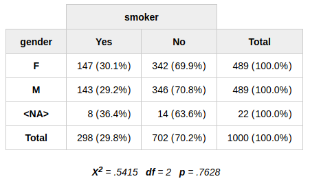
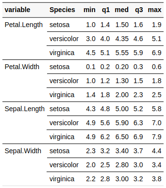
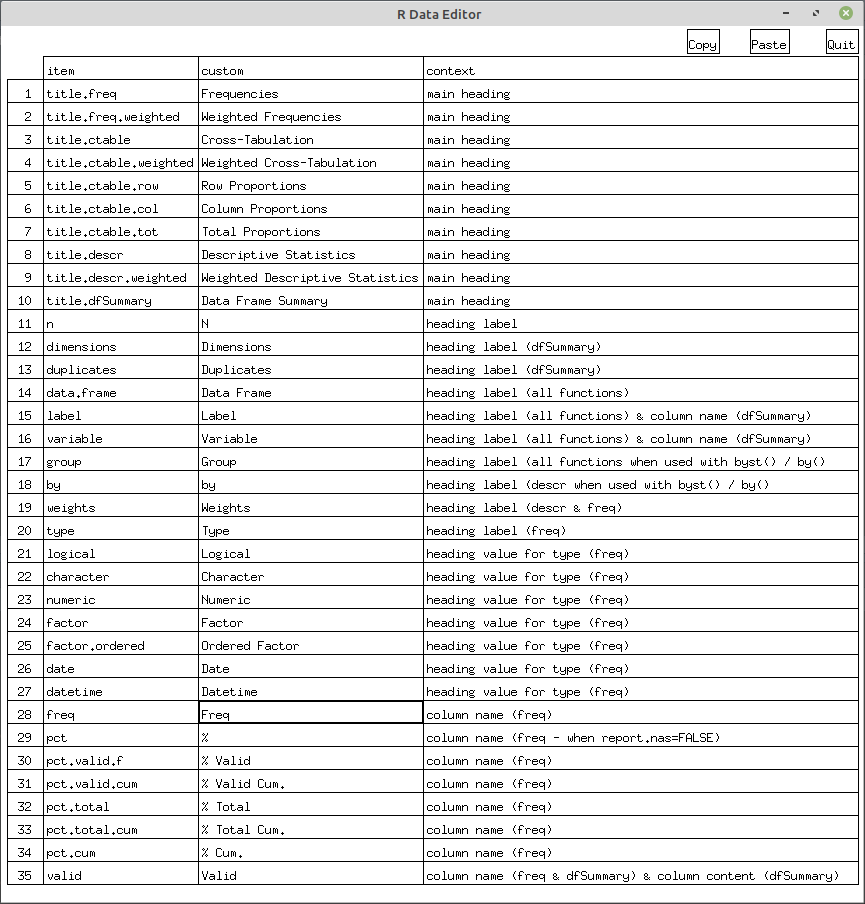

# summarytools <a href='https://github.com/dcomtois/summarytools'></a>

<!-- badges -->

[](https://cran.r-project.org/package=summarytools)
[](http://cran.rstudio.com/web/packages/summarytools/index.html)
[](http://cran.rstudio.com/web/packages/summarytools/index.html)
[](http://www.rdocumentation.org/packages/summarytools)

The following vignettes complement this page:

[Recommendations for Using summarytools With
Rmarkdown](https://cran.r-project.org/web/packages/summarytools/vignettes/Recommendations-rmarkdown.html)  
[Introduction to
summarytools](https://cran.r-project.org/web/packages/summarytools/vignettes/Introduction.html)
– Contents similar to this page (minus installation instructions), with
fancier table stylings.

# 1\. Overview

**summarytools** is a an [*R*](https://www.r-project.org) package for
data exploration and simple reporting.

**Four functions** are at its
core:

|                               Function | Description                                                                                                                                                                                                                                                                                       |
| -------------------------------------: | :------------------------------------------------------------------------------------------------------------------------------------------------------------------------------------------------------------------------------------------------------------------------------------------------ |
|           <a href="#freq">`freq()`</a> | **Frequency Tables** featuring counts, proportions, as well as missing data information                                                                                                                                                                                                           |
|       <a href="#ctable">`ctable()`</a> | **Cross-Tabulations** (joint frequencies) between pairs of discrete variables featuring marginal sums as well as row, column or total proportions                                                                                                                                                 |
|         <a href="#descr">`descr()`</a> | **Descriptive (Univariate) Statistics** for numerical data featuring common measures of central tendency and dispersion                                                                                                                                                                           |
| <a href="#dfsummary">`dfSummary()`</a> | Extensive **Data Frame Summaries** featuring type-specific information for all variables in a data frame: univariate statistics and/or frequency distributions, bar charts or histograms, as well as missing data counts. Very useful to quickly detect anomalies and identify trends at a glance |

## 1.1 Motivation

The package was developed with the following objectives in mind:

  - Provide a coherent set of easy to use descriptive functions that are
    akin to those included in commercial statistical packages such as
    SAS, SPSS and Stata  
  - Offer flexibility in terms of output formats and contents  
  - Integrate well with software and tools commonly used for reporting
    ([the RStudio IDE](https://rstudio.com/products/rstudio/),
    [Rmarkdown](https://rmarkdown.rstudio.com/), and
    [knitr](https://yihui.org/knitr/)) while also allowing for
    stand-alone, simple report generation

## 1.2 Redirecting Outputs

Results can be

  - Displayed in the *R* console as plain text  
  - Rendered as *html* and shown in RStudio’s Viewer or in a Web
    Browser  
  - Written to / appended to plain text, *markdown*, or *html* files
  - Used in *Rmarkdown* reports

## 1.3 Other Characteristics

  - **Pipe-Friendly**:
      - The `%>%` and `%$%` operators from the
        [magrittr](https://cran.r-project.org/package=magrittr) package
        are supported  
      - The `%>>%` operator from the
        [pipeR](https://cran.r-project.org/package=pipeR) package is
        also supported  
  - **Multilingual**:
      - Built-in translations exist for French, Portuguese, Spanish,
        Russian and Turkish  
      - Users can easily add custom translations or modify existing sets
        of translations as needed  
  - **Weights-ready**: except for `dfSummary()`, all core functions
    support sampling weights
  - **Flexible**: default values for most function arguments can be
    modified, which simplifies coding and minimizes redundancy in the
    code  
  - **Tweakable**: For text / *markdown* table generation, the
    [**pander**](http://rapporter.github.io/pander/) package is used.
    For *html* content,
    [**htmltools**](https://CRAN.R-project.org/package=htmltools) and
    the [**Bootstrap**](https://getbootstrap.com/) *CSS* framework are
    used. Both **pander** and **Bootstrap** features and options can be
    used to fine-tune **summarytools**’ results

## 1.4 Installing summarytools

### Required Software

Additional software is used by **summarytools** to fine-tune graphics as
well as offer interactive features. If installing **summarytools** for
the first time, click on the link corresponding to your Operating System
to get detailed instructions. Note that on Windows, no additional
software is required.

<a href="#required-mac-os">Mac OS X</a>  
<a href="#required-debian">Ubuntu / Debian / Mint</a>  
<a href="#required--older-ubuntu">Older Ubuntu (14 and 16)</a>  
<a href="#required-fedora">Fedora / Red Hat / CentOS</a>  
<a href="#required-solaris">Solaris</a>

### Installing From GitHub

This is the recommended method, as some minor fixes and improvements are
regularly added.

``` r
install.packages("remotes") # Using devtools is also possible
library(remotes)
install_github("rapporter/pander") # Necessary for optimal results!
install_github("dcomtois/summarytools")
```

### Installing From CRAN

CRAN versions are stable but are not updated as often as the GitHub
versions.

``` r
install.packages("summarytools")
```

# 2\. The Four Core Functions

## <a id="freq"></a>2.1 Frequency Tables With freq()

The `freq()` function generates frequency tables with counts,
proportions, as well as missing data information.

``` r
freq(iris$Species, plain.ascii = FALSE, style = "rmarkdown")
```

### Frequencies

**iris$Species**  
**Type:**
Factor

|                | Freq | % Valid | % Valid Cum. | % Total | % Total Cum. |
| -------------: | ---: | ------: | -----------: | ------: | -----------: |
|     **setosa** |   50 |   33.33 |        33.33 |   33.33 |        33.33 |
| **versicolor** |   50 |   33.33 |        66.67 |   33.33 |        66.67 |
|  **virginica** |   50 |   33.33 |       100.00 |   33.33 |       100.00 |
|     **\<NA\>** |    0 |         |              |    0.00 |       100.00 |
|      **Total** |  150 |  100.00 |       100.00 |  100.00 |       100.00 |

In this first example, the `plain.ascii` and `style` arguments were
specified. However, since we have defined them globally with
`st_options()`, they are redundant and will be omitted from hereon.

### 2.1.1 Ignoring Missing Data

The `report.nas` argument can be set to `FALSE` in order to ignore
missing values (*NA*’s). Doing so has the following effects on the
resulting table:

1.  The **\<NA\>** row is omitted  
2.  The **% Total** and **% Total Cum.** columns are also omitted  
3.  The **% Valid** column simply becomes **%**  
4.  The **% Valid Cum.** column simply becomes **% Cum.**

<!-- end list -->

``` r
freq(iris$Species, report.nas = FALSE, headings = FALSE)
```

|                | Freq |      % | % Cum. |
| -------------: | ---: | -----: | -----: |
|     **setosa** |   50 |  33.33 |  33.33 |
| **versicolor** |   50 |  33.33 |  66.67 |
|  **virginica** |   50 |  33.33 | 100.00 |
|      **Total** |  150 | 100.00 | 100.00 |

Note that the `headings = FALSE` parameter suppresses the heading
section.

### 2.1.2 Minimalistic Frequency Tables

By “switching off” all optional elements, a much simpler table will be
produced:

``` r
freq(iris$Species, report.nas = FALSE, totals = FALSE, 
     cumul = FALSE, headings = FALSE)
```

|                | Freq |     % |
| -------------: | ---: | ----: |
|     **setosa** |   50 | 33.33 |
| **versicolor** |   50 | 33.33 |
|  **virginica** |   50 | 33.33 |

### 2.1.3 Multiple Frequency Tables

To generate frequency tables for all variables in a data frame, no need
to use `lapply()`; `freq()` handles whole data frames, too:

``` r
freq(tobacco)
```

To avoid cluttering the results, numerical columns having more than 25
distinct values will be discarded. This threshold of 25 can be changed
by using for example `st_options(freq.ignore.threshold = 10)`.

**Note**: the *tobacco* data frame contains simulated data and is
included in the package.

### 2.1.4 Subsetting (Filtering) Frequency Tables

The `rows` parameter allows subsetting frequency tables; we can use this
parameter it different ways:

  - To filter rows by their order of appearance, we use a numerical
    vector; `rows = 1:10` will show the frequencies for the first 10
    values only
  - To filter rows by name, we can use
      - a character vector specifying the exact row names we wish to
        keep in the results  
      - a single character string which will be used as a regular
        expression to select the matching column(s); see `?regex` for
        more information on regular expressions

Used in combination with the `order` argument, the subsetting feature
can be quite practical. For a character variable containing a large
number of distinct values, showing only the most frequent is easily
done:

``` r
freq(tobacco$disease, order = "freq", rows = 1:5)
```

### Frequencies

**tobacco$disease**  
**Type:**
Character

|                  | Freq | % Valid | % Valid Cum. | % Total | % Total Cum. |
| ---------------: | ---: | ------: | -----------: | ------: | -----------: |
| **Hypertension** |   36 |   16.22 |        16.22 |    3.60 |         3.60 |
|       **Cancer** |   34 |   15.32 |        31.53 |    3.40 |         7.00 |
|  **Cholesterol** |   21 |    9.46 |        40.99 |    2.10 |         9.10 |
|        **Heart** |   20 |    9.01 |        50.00 |    2.00 |        11.10 |
|    **Pulmonary** |   20 |    9.01 |        59.01 |    2.00 |        13.10 |
|      **(Other)** |   91 |   40.99 |       100.00 |    9.10 |        22.20 |
|       **\<NA\>** |  778 |         |              |   77.80 |       100.00 |
|        **Total** | 1000 |  100.00 |       100.00 |  100.00 |       100.00 |

Instead of `"freq"`, we can use `"-freq"` to reverse the ordering and
get results ranked from lowest to highest in frequency.

To account for the frequencies of unshown values, the “**(Other)**” row
is automatically added.

### 2.1.5 Collapsible Sections

When generating *html* results, use the `collapse = TRUE` argument with
`print()` or `view()` to get collapsible sections; clicking on the
variable name in the heading section will collapse / reveal the
frequency table (results not shown).

``` r
view(freq(tobacco), collapse = TRUE)
```

## <a id="ctable"></a>2.2 Cross-Tabulations with ctable()

`ctable()` generates cross-tabulations (joint frequencies) for pairs of
categorical variables.

Since *markdown* does not support multiline table headings (but does
accept *html* code), we’ll use the *html* rendering feature for this
section.

Using the *tobacco* data frame, we’ll cross-tabulate the two categorical
variables *smoker* and *diseased*.

``` r
print(ctable(x = tobacco$smoker, y = tobacco$diseased, prop = "r"),
      method = "render")
```


### 2.2.1 Row, Column or Total Proportions

Row proportions are shown by default. To display *column* or *total*
proportions, use `prop = "c"` or `prop = "t"`, respectively. To omit
proportions altogether, use `prop = "n"`.

### 2.2.2 Minimalistic Cross-Tabulations

By “switching off” all optional features, we get a simple “2 x 2” table:

``` r
with(tobacco, 
     print(ctable(x = smoker, y = diseased, prop = 'n',
                  totals = FALSE, headings = FALSE),
           method = "render"))
```


### 2.2.3 Chi-Square (𝛘<sup>2</sup>) Statistic

To display the chi-square statistic, set `chisq = TRUE`. To show how
pipes can be used with **summarytools**, we’ll use **magrittr**’s `%$%`
and `%>%` operators:

``` r
library(magrittr)
tobacco %$%  # The %$% operator replaces with(tobacco, ...)
  ctable(gender, smoker, chisq = TRUE, headings = FALSE) %>%
  print(method = "render")
```



## <a id="descr"></a>2.3 Descriptive Statistics With descr()

`descr()` generates descriptive / univariate statistics, *i.e.* common
central tendency statistics and measures of dispersion. It accepts
single vectors as well as data frames; in the latter case, all
non-numerical columns are ignored, with a message to that effect.

``` r
descr(iris)
```

### Descriptive Statistics

**iris**  
**N:**
150

|                 | Petal.Length | Petal.Width | Sepal.Length | Sepal.Width |
| --------------: | -----------: | ----------: | -----------: | ----------: |
|        **Mean** |         3.76 |        1.20 |         5.84 |        3.06 |
|     **Std.Dev** |         1.77 |        0.76 |         0.83 |        0.44 |
|         **Min** |         1.00 |        0.10 |         4.30 |        2.00 |
|          **Q1** |         1.60 |        0.30 |         5.10 |        2.80 |
|      **Median** |         4.35 |        1.30 |         5.80 |        3.00 |
|          **Q3** |         5.10 |        1.80 |         6.40 |        3.30 |
|         **Max** |         6.90 |        2.50 |         7.90 |        4.40 |
|         **MAD** |         1.85 |        1.04 |         1.04 |        0.44 |
|         **IQR** |         3.50 |        1.50 |         1.30 |        0.50 |
|          **CV** |         0.47 |        0.64 |         0.14 |        0.14 |
|    **Skewness** |       \-0.27 |      \-0.10 |         0.31 |        0.31 |
| **SE.Skewness** |         0.20 |        0.20 |         0.20 |        0.20 |
|    **Kurtosis** |       \-1.42 |      \-1.36 |       \-0.61 |        0.14 |
|     **N.Valid** |       150.00 |      150.00 |       150.00 |      150.00 |
|   **Pct.Valid** |       100.00 |      100.00 |       100.00 |      100.00 |

### 2.3.1 Transposing and Selecting Statistics

Results can be transposed by using `transpose = TRUE`, and statistics
can be selected using the `stats` argument:

``` r
descr(iris, stats = c("mean", "sd"), transpose = TRUE, headings = FALSE)
```

|                  | Mean | Std.Dev |
| ---------------: | ---: | ------: |
| **Petal.Length** | 3.76 |    1.77 |
|  **Petal.Width** | 1.20 |    0.76 |
| **Sepal.Length** | 5.84 |    0.83 |
|  **Sepal.Width** | 3.06 |    0.44 |

See `?descr` for a list of all available statistics. Special values
“all”, “fivenum”, and “common” are also valid values for the `stats`
argument. The default value is “all”.

## <a id="dfsummary"></a>2.4 Data Frame Summaries With dfSummary()

`dfSummary()` creates a summary table with statistics, frequencies and
graphs for all variables in a data frame. The information displayed is
type-specific (character, factor, numeric, date) and also varies
according to the number of distinct values.

To see the results in RStudio’s Viewer (or in the default Web browser if
working in another IDE or from a terminal window), we use the `view()`
function:

``` r
view(dfSummary(iris))
```


### 2.4.1 Using dfSummary() in Rmarkdown Documents

When using `dfSummary()` in *Rmarkdown* documents, it is generally a
good idea to exclude a column or two to avoid margin overflow. Since the
*Valid* and *Missing* columns are redundant, we can drop either one of
them.

``` r
dfSummary(tobacco, plain.ascii = FALSE, style = "grid", 
          graph.magnif = 0.75, valid.col = FALSE, tmp.img.dir = "/tmp")
```


**The `tmp.img.dir` parameter is mandatory** when generating
*dfSummaries* in *Rmarkdown* documents, except for *html* rendering. The
explanation for this can be found [further below](#tmp-img-dir).

### 2.4.2 Advanced Features

This function

  - Reports the number of duplicate records in the heading section  
  - Detects UPC/EAN codes (barcode numbers) and doesn’t calculate
    irrelevant statistics for them  
  - Detects email addresses and reports counts of valid, invalid and
    duplicate addresses

### 2.4.3 Excluding Columns

Although most columns can be excluded using the function’s parameters,
it is also possible to delete them with the following syntax (results
not shown):

``` r
dfs <- dfSummary(iris)
dfs$Variable <- NULL # This deletes the "Variable" column
```

<br/>

# 3\. Grouped Statistics Using stby()

To produce optimal results, **summarytools** has its own version of the
base `by()` function. It’s called `stby()`, and we use it exactly as we
would `by()`:

``` r
(iris_stats_by_species <- stby(data = iris, 
                               INDICES = iris$Species, 
                               FUN = descr, stats = "common", transpose = TRUE))
```

    ## Non-numerical variable(s) ignored: Species

### Descriptive Statistics

**iris**  
**Group:** Species = setosa  
**N:**
50

|                  | Mean | Std.Dev |  Min | Median |  Max | N.Valid | Pct.Valid |
| ---------------: | ---: | ------: | ---: | -----: | ---: | ------: | --------: |
| **Petal.Length** | 1.46 |    0.17 | 1.00 |   1.50 | 1.90 |   50.00 |    100.00 |
|  **Petal.Width** | 0.25 |    0.11 | 0.10 |   0.20 | 0.60 |   50.00 |    100.00 |
| **Sepal.Length** | 5.01 |    0.35 | 4.30 |   5.00 | 5.80 |   50.00 |    100.00 |
|  **Sepal.Width** | 3.43 |    0.38 | 2.30 |   3.40 | 4.40 |   50.00 |    100.00 |

**Group:** Species = versicolor  
**N:**
50

|                  | Mean | Std.Dev |  Min | Median |  Max | N.Valid | Pct.Valid |
| ---------------: | ---: | ------: | ---: | -----: | ---: | ------: | --------: |
| **Petal.Length** | 4.26 |    0.47 | 3.00 |   4.35 | 5.10 |   50.00 |    100.00 |
|  **Petal.Width** | 1.33 |    0.20 | 1.00 |   1.30 | 1.80 |   50.00 |    100.00 |
| **Sepal.Length** | 5.94 |    0.52 | 4.90 |   5.90 | 7.00 |   50.00 |    100.00 |
|  **Sepal.Width** | 2.77 |    0.31 | 2.00 |   2.80 | 3.40 |   50.00 |    100.00 |

**Group:** Species = virginica  
**N:**
50

|                  | Mean | Std.Dev |  Min | Median |  Max | N.Valid | Pct.Valid |
| ---------------: | ---: | ------: | ---: | -----: | ---: | ------: | --------: |
| **Petal.Length** | 5.55 |    0.55 | 4.50 |   5.55 | 6.90 |   50.00 |    100.00 |
|  **Petal.Width** | 2.03 |    0.27 | 1.40 |   2.00 | 2.50 |   50.00 |    100.00 |
| **Sepal.Length** | 6.59 |    0.64 | 4.90 |   6.50 | 7.90 |   50.00 |    100.00 |
|  **Sepal.Width** | 2.97 |    0.32 | 2.20 |   3.00 | 3.80 |   50.00 |    100.00 |

## 3.1 Special Case of descr() with stby()

When used to produce split-group statistics for a single variable,
`stby()` assembles everything into a single table instead of displaying
a series of one-column tables.

``` r
with(tobacco, stby(data = BMI, INDICES = age.gr, 
                   FUN = descr, stats = c("mean", "sd", "min", "med", "max")))
```

### Descriptive Statistics

**BMI by age.gr**  
**Data Frame:** tobacco  
**N:** 258

|             | 18-34 | 35-50 | 51-70 |  71 + |
| ----------: | ----: | ----: | ----: | ----: |
|    **Mean** | 23.84 | 25.11 | 26.91 | 27.45 |
| **Std.Dev** |  4.23 |  4.34 |  4.26 |  4.37 |
|     **Min** |  8.83 | 10.35 |  9.01 | 16.36 |
|  **Median** | 24.04 | 25.11 | 26.77 | 27.52 |
|     **Max** | 34.84 | 39.44 | 39.21 | 38.37 |

## 3.2 Using stby() With ctable()

The syntax is a little trickier for this one, so here is an example
(results not shown):

``` r
stby(list(x = tobacco$smoker, y = tobacco$diseased), 
     INDICES = tobacco$gender, FUN = ctable)

# or equivalently
with(tobacco, 
     stby(list(x = smoker, y = diseased), 
          INDICES = gender, FUN = ctable))
```

# 4\. Grouped Statistics Using dplyr::group\_by()

To create grouped statistics with `freq()`, `descr()` or `dfSummary()`,
it is possible to use **dplyr**’s `group_by()` as an alternative to
`stby()`. Syntactic differences aside, one key distinction is that
`group_by()` considers `NA` values on the grouping variables as a valid
category, albeit with a warning message suggesting the use of
`forcats::fct_explicit_na` to make `NA`’s explicit in factors. Following
this advice, we get:

``` r
library(dplyr)
tobacco$gender %<>% forcats::fct_explicit_na()
tobacco %>% group_by(gender) %>% descr(stats = "fivenum")
```

    ## Non-numerical variable(s) ignored: age.gr, smoker, diseased, disease

### Descriptive Statistics

**tobacco**  
**Group:** gender = F  
**N:** 489

|            |   age |   BMI | cigs.per.day | samp.wgts |
| ---------: | ----: | ----: | -----------: | --------: |
|    **Min** | 18.00 |  9.01 |         0.00 |      0.86 |
|     **Q1** | 34.00 | 22.98 |         0.00 |      0.86 |
| **Median** | 50.00 | 25.87 |         0.00 |      1.04 |
|     **Q3** | 66.00 | 29.48 |        10.50 |      1.05 |
|    **Max** | 80.00 | 39.44 |        40.00 |      1.06 |

**Group:** gender = M  
**N:** 489

|            |   age |   BMI | cigs.per.day | samp.wgts |
| ---------: | ----: | ----: | -----------: | --------: |
|    **Min** | 18.00 |  8.83 |         0.00 |      0.86 |
|     **Q1** | 34.00 | 22.52 |         0.00 |      0.86 |
| **Median** | 49.50 | 25.14 |         0.00 |      1.04 |
|     **Q3** | 66.00 | 27.96 |        11.00 |      1.05 |
|    **Max** | 80.00 | 36.76 |        40.00 |      1.06 |

**Group:** gender = (Missing)  
**N:** 22

|            |   age |   BMI | cigs.per.day | samp.wgts |
| ---------: | ----: | ----: | -----------: | --------: |
|    **Min** | 19.00 | 20.24 |         0.00 |      0.86 |
|     **Q1** | 36.00 | 24.97 |         0.00 |      1.04 |
| **Median** | 55.50 | 27.16 |         0.00 |      1.05 |
|     **Q3** | 64.00 | 30.23 |        10.00 |      1.05 |
|    **Max** | 80.00 | 32.43 |        28.00 |      1.06 |

# 5\. Creating Tidy Tables With tb()

When generating `freq()` or `descr()` tables, it is possible to turn the
results into “tidy” tables with the use of the `tb()` function (think of
*tb* as a diminutive for *tibble*). For example:

``` r
library(magrittr)
iris %>% descr(stats = "common") %>% tb()
```

``` small
## # A tibble: 4 x 8
##   variable      mean    sd   min   med   max n.valid pct.valid
##   <chr>        <dbl> <dbl> <dbl> <dbl> <dbl>   <dbl>     <dbl>
## 1 Petal.Length  3.76 1.77    1    4.35   6.9     150       100
## 2 Petal.Width   1.20 0.762   0.1  1.3    2.5     150       100
## 3 Sepal.Length  5.84 0.828   4.3  5.8    7.9     150       100
## 4 Sepal.Width   3.06 0.436   2    3      4.4     150       100
```

``` r
iris$Species %>% freq(cumul = FALSE, report.nas = FALSE) %>% tb()
```

``` small
## # A tibble: 3 x 3
##   Species     freq   pct
##   <fct>      <dbl> <dbl>
## 1 setosa        50  33.3
## 2 versicolor    50  33.3
## 3 virginica     50  33.3
```

By definition, no total rows are part of *tidy* tables, and the row
names are converted to a regular column. Note that for displaying
*tibbles* using *Rmarkdown*, the **knitr** chunk option ‘results’ should
be set to “markup” instead of “asis”.

## 5.1 Tidy Split-Group Statistics

Here are some examples showing how lists created using `stby()` or
`group_by()` can be transformed into *tidy tibbles*.

``` r
grouped_descr <- stby(data = exams, INDICES = exams$gender, 
                      FUN = descr, stats = "common")
grouped_descr %>% tb()
```

``` small
## # A tibble: 12 x 9
##    gender variable   mean    sd   min   med   max n.valid pct.valid
##    <fct>  <chr>     <dbl> <dbl> <dbl> <dbl> <dbl>   <dbl>     <dbl>
##  1 Girl   economics  72.5  7.79  62.3  70.2  89.6      14      93.3
##  2 Girl   english    73.9  9.41  58.3  71.8  93.1      14      93.3
##  3 Girl   french     71.1 12.4   44.8  68.4  93.7      14      93.3
##  4 Girl   geography  67.3  8.26  50.4  67.3  78.9      15     100  
##  5 Girl   history    71.2  9.17  53.9  72.9  86.4      15     100  
##  6 Girl   math       73.8  9.03  55.6  74.8  86.3      14      93.3
##  7 Boy    economics  75.2  9.40  60.5  71.7  94.2      15     100  
##  8 Boy    english    77.8  5.94  69.6  77.6  90.2      15     100  
##  9 Boy    french     76.6  8.63  63.2  74.8  94.7      15     100  
## 10 Boy    geography  73   12.4   47.2  71.2  96.3      14      93.3
## 11 Boy    history    74.4 11.2   54.4  72.6  93.5      15     100  
## 12 Boy    math       73.3  9.68  60.5  72.2  93.2      14      93.3
```

The `order` parameter controls row ordering:

``` r
grouped_descr %>% tb(order = 2)
```

``` small
## # A tibble: 12 x 9
##    gender variable   mean    sd   min   med   max n.valid pct.valid
##    <fct>  <chr>     <dbl> <dbl> <dbl> <dbl> <dbl>   <dbl>     <dbl>
##  1 Girl   economics  72.5  7.79  62.3  70.2  89.6      14      93.3
##  2 Boy    economics  75.2  9.40  60.5  71.7  94.2      15     100  
##  3 Girl   english    73.9  9.41  58.3  71.8  93.1      14      93.3
##  4 Boy    english    77.8  5.94  69.6  77.6  90.2      15     100  
##  5 Girl   french     71.1 12.4   44.8  68.4  93.7      14      93.3
##  6 Boy    french     76.6  8.63  63.2  74.8  94.7      15     100  
##  7 Girl   geography  67.3  8.26  50.4  67.3  78.9      15     100  
##  8 Boy    geography  73   12.4   47.2  71.2  96.3      14      93.3
##  9 Girl   history    71.2  9.17  53.9  72.9  86.4      15     100  
## 10 Boy    history    74.4 11.2   54.4  72.6  93.5      15     100  
## 11 Girl   math       73.8  9.03  55.6  74.8  86.3      14      93.3
## 12 Boy    math       73.3  9.68  60.5  72.2  93.2      14      93.3
```

Setting `order = 3` changes the order of the sort variables exactly as
with `order = 2`, but it also reorders the columns:

``` r
grouped_descr %>% tb(order = 3)
```

``` small
## # A tibble: 12 x 9
##    variable  gender  mean    sd   min   med   max n.valid pct.valid
##    <chr>     <fct>  <dbl> <dbl> <dbl> <dbl> <dbl>   <dbl>     <dbl>
##  1 economics Girl    72.5  7.79  62.3  70.2  89.6      14      93.3
##  2 economics Boy     75.2  9.40  60.5  71.7  94.2      15     100  
##  3 english   Girl    73.9  9.41  58.3  71.8  93.1      14      93.3
##  4 english   Boy     77.8  5.94  69.6  77.6  90.2      15     100  
##  5 french    Girl    71.1 12.4   44.8  68.4  93.7      14      93.3
##  6 french    Boy     76.6  8.63  63.2  74.8  94.7      15     100  
##  7 geography Girl    67.3  8.26  50.4  67.3  78.9      15     100  
##  8 geography Boy     73   12.4   47.2  71.2  96.3      14      93.3
##  9 history   Girl    71.2  9.17  53.9  72.9  86.4      15     100  
## 10 history   Boy     74.4 11.2   54.4  72.6  93.5      15     100  
## 11 math      Girl    73.8  9.03  55.6  74.8  86.3      14      93.3
## 12 math      Boy     73.3  9.68  60.5  72.2  93.2      14      93.3
```

For more details, see `?tb`.

## 5.2 A Bridge to Other Packages

**summarytools** objects are not always compatible with packages focused
on table formatting, such as
[formattable](https://CRAN.R-project.org/package=formattable) or
[kableExtra](https://CRAN.R-project.org/package=kableExtra). However,
`tb()` can be used as a “bridge”, an intermediary step turning `freq()`
and `descr()` objects into simple tables that any package can work with.
Here is an example using **kableExtra**:

``` r
library(kableExtra)
library(magrittr)
stby(iris, iris$Species, descr, stats = "fivenum") %>%
  tb(order = 3) %>%
  kable(format = "html", digits = 2) %>%
  collapse_rows(columns = 1, valign = "top")
```



# 6\. Redirecting Outputs to Files

Using the `file` argument with `print()` or `view()`, we can write
outputs to a file, be it *html*, *Rmd*, *md*, or just plain text
(*txt*). The file extension is used to determine the type of content to
write out.

``` r
view(iris_stats_by_species, file = "~/iris_stats_by_species.html")
view(iris_stats_by_species, file = "~/iris_stats_by_species.md")
```

**A Note About *PDF* documents**

There is no direct way to create a *PDF* file with **summarytools**. One
option is to generate an *html* file and convert it to *PDF* using
[Pandoc](https://pandoc.org) or
[WK\<html\>TOpdf](https://wkhtmltopdf.org/index.html) (the latter gives
better results than Pandoc with `dfSummary()` output). Another option is
to create an *Rmd* document using *PDF* as the output format, but with a
caveat: displaying graphs with `dfSummary()` will cause vertical
misalignment (we hope to resolve this issue in a future version).

## 6.1 Appending Output Files

The `append` argument allows adding content to existing files generated
by **summarytools**. This is useful if we wish to include several
statistical tables in a single file. It is a quick alternative to
creating an *Rmd* document.

# 7\. Global options

The following options can be set with
`st_options()`:

## 7.1 General Options

|        Option name |   Default | Note                                           |
| -----------------: | --------: | :--------------------------------------------- |
|              style |  “simple” | Set to “rmarkdown” in .Rmd documents           |
|        plain.ascii |      TRUE | Set to FALSE in .Rmd documents                 |
|       round.digits |         2 | Number of decimals to show                     |
|           headings |      TRUE | Formerly “omit.headings”                       |
|           footnote | “default” | Personalize, or set to NA to omit              |
|     display.labels |      TRUE | Show variable / data frame labels in headings  |
| bootstrap.css (\*) |      TRUE | Include Bootstrap 4 CSS in *html* output files |
|         custom.css |        NA | Path to your own CSS file                      |
|        escape.pipe |     FALSE | Useful for some Pandoc conversions             |
|  subtitle.emphasis |      TRUE | Controls headings formatting                   |
|               lang |      “en” | Language (always 2-letter, lowercase)          |

(\*) Set to FALSE in Shiny
apps

## 7.2 Function-Specific Options

|            Option name | Default | Note                                                |
| ---------------------: | ------: | :-------------------------------------------------- |
|            freq.totals |    TRUE | Display totals row in freq()                        |
|        freq.report.nas |    TRUE | Display <NA> row and “valid” columns                |
|            freq.silent |   FALSE | Hide console messages                               |
|            ctable.prop |     “r” | Display **r**ow proportions by default              |
|          ctable.totals |    TRUE | Show marginal totals                                |
|            descr.stats |   “all” | “fivenum”, “common” or vector of stats              |
|        descr.transpose |   FALSE | Display stats in columns instead of rows            |
|           descr.silent |   FALSE | Hide console messages                               |
|   dfSummary.varnumbers |    TRUE | Show variable numbers in 1st col.                   |
|   dfSummary.labels.col |    TRUE | Show variable labels when present                   |
|    dfSummary.graph.col |    TRUE | Show graphs                                         |
|    dfSummary.valid.col |    TRUE | Include the Valid column in the output              |
|       dfSummary.na.col |    TRUE | Include the Missing column in the output            |
| dfSummary.graph.magnif |       1 | Zoom factor for bar plots and histograms            |
|       dfSummary.silent |   FALSE | Hide console messages                               |
|            tmp.img.dir |      NA | Directory to store [temporary images](#tmp-img-dir) |

**Examples**

``` r
st_options()                      # Display all global options values
st_options('round.digits')        # Display the value of a specific option
st_options(style = 'rmarkdown',   # Set the value of one or several options
           footnote = NA)         # Turn off the footnote for all html output
```

# 8\. Overriding Formatting Attributes

When a **summarytools** object is created, its formatting attributes are
stored within it. However, we can override most of them when using
`print()` or `view()`.

## 8.1 Overriding Function-Specific Arguments

This table indicates what arguments can be used with `print()` or
`view()` to override formatting attributes:

|          Argument | freq | ctable | descr | dfSummary |
| ----------------: | :--: | :----: | :---: | :-------: |
|             style |  x   |   x    |   x   |     x     |
|      round.digits |  x   |   x    |   x   |           |
|       plain.ascii |  x   |   x    |   x   |     x     |
|           justify |  x   |   x    |   x   |     x     |
|          headings |  x   |   x    |   x   |     x     |
|    display.labels |  x   |   x    |   x   |     x     |
|        varnumbers |      |        |       |     x     |
|        labels.col |      |        |       |     x     |
|         graph.col |      |        |       |     x     |
|         valid.col |      |        |       |     x     |
|            na.col |      |        |       |     x     |
|        col.widths |      |        |       |     x     |
|            totals |  x   |   x    |       |           |
|        report.nas |  x   |        |       |           |
|      display.type |  x   |        |       |           |
|           missing |  x   |        |       |           |
| split.tables (\*) |  x   |   x    |   x   |     x     |
|      caption (\*) |  x   |   x    |   x   |     x     |

(\*) These are **pander options**; several others can be used when
calling **summarytools**’ core functions. See [pander: An R Pandoc
Writer](http://rapporter.github.io/pander/) for a list of all available
options.

## 8.2 Overriding Heading Contents

To change the information shown in the heading section, use the
following arguments with `print()` or `view()`:

|         Argument | freq | ctable | descr | dfSummary |
| ---------------: | :--: | :----: | :---: | :-------: |
|       Data.frame |  x   |   x    |   x   |     x     |
| Data.frame.label |  x   |   x    |   x   |     x     |
|         Variable |  x   |   x    |   x   |           |
|   Variable.label |  x   |   x    |   x   |           |
|            Group |  x   |   x    |   x   |     x     |
|             date |  x   |   x    |   x   |     x     |
|          Weights |  x   |        |   x   |           |
|        Data.type |  x   |        |       |           |
|     Row.variable |      |   x    |       |           |
|     Col.variable |      |   x    |       |           |

### Example

In the following example, we will override three formatting, and one
heading attribute:

``` r
(age_stats <- freq(tobacco$age.gr)) 
```

### Frequencies

**tobacco$age.gr**  
**Type:** Factor

|            | Freq | % Valid | % Valid Cum. | % Total | % Total Cum. |
| ---------: | ---: | ------: | -----------: | ------: | -----------: |
|  **18-34** |  258 |   26.46 |        26.46 |   25.80 |        25.80 |
|  **35-50** |  241 |   24.72 |        51.18 |   24.10 |        49.90 |
|  **51-70** |  317 |   32.51 |        83.69 |   31.70 |        81.60 |
|   **71 +** |  159 |   16.31 |       100.00 |   15.90 |        97.50 |
| **\<NA\>** |   25 |         |              |    2.50 |       100.00 |
|  **Total** | 1000 |  100.00 |       100.00 |  100.00 |       100.00 |

``` r
print(age_stats, report.nas = FALSE, totals = FALSE, display.type = FALSE,
      Variable.label = "Age Group")
```

### Frequencies

**tobacco$age.gr**  
**Label:** Age Group

|           | Freq |     % | % Cum. |
| --------: | ---: | ----: | -----: |
| **18-34** |  258 | 26.46 |  26.46 |
| **35-50** |  241 | 24.72 |  51.18 |
| **51-70** |  317 | 32.51 |  83.69 |
|  **71 +** |  159 | 16.31 | 100.00 |

## 8.3 Order of Priority for Parameters / Options

1.  `print()` or `view()` parameters have precedence (overriding
    feature)  
2.  `freq() / ctable() / descr() / dfSummary()` parameters come second  
3.  Global options set with `st_options()` come third

# 9\. Fine-Tuning Looks with CSS

When creating *html* reports, both
[Bootstrap](https://getbootstrap.com/)’s *CSS* and *summarytools.css*
are included by default. For greater control on the looks of *html*
content, it is also possible to add class definitions in a custom *CSS*
file.

### Example

We need to use a very small font size for a simple *html* report
containing a `dfSummary()`. For this, we create a *.css* file (with the
name of our choosing) which contains the following class definition:

``` css
.tiny-text {
  font-size: 8px;
}
```

Then we use `print()`’s `custom.css` argument to specify to location of
our newly created *CSS* file (results not shown):

``` r
print(dfSummary(tobacco), custom.css = 'path/to/custom.css', 
      table.classes = 'tiny-text', file = "tiny-tobacco-dfSummary.html")
```

# 10\. Creating *Shiny* apps

To successfully include **summarytools** functions in *Shiny* apps,

  - use *html* rendering  
  - set `bootstrap.css = FALSE` to avoid interacting with the app’s
    layout  
  - set `headings = FALSE` in case problems arise  
  - adjust graph sizes with `print()`’s `graph.magnif` parameter or with
    the `dfSummary.graph.magnif` global option  
  - if `dfSummary()` tables are too wide, omit a column or two
    (`valid.col` and `varnumbers`, for instance)  
  - if the results are still unsatisfactory, set column widths manually
    with `print()`’s `col.widths` parameter

**Example** (results not shown)

``` r
print(dfSummary(somedata, varnumbers = FALSE, valid.col = FALSE, 
                graph.magnif = 0.8), 
      method = 'render',
      headings = FALSE,
      bootstrap.css = FALSE)
```

# 11\. Graphs in Markdown dfSummaries

When using `dfSummary()` in an *Rmd* document using *markdown* styling
(as opposed to *html* rendering), three elements are needed in order to
display the *png* graphs properly:

1 - `plain.ascii` must be set to FALSE  
2 - `style` must be set to “grid”  
3 - `tmp.img.dir` must be defined

Why the third element? Although *R* makes it really easy to create
temporary files and directories, they do have long pathnames, especially
on Windows. Unfortunately, Pandoc determines the final (rendered) column
widths by counting characters in a cell, even if those characters are
paths pointing to images.

At this time, there seems to be only one solution around this problem:
cut down on characters in image paths. So instead of
    this:

    +-----------+---------------------------------------------------------------------+---------+
    | Variable  | Graph                                                               | Valid   |
    +===========+=====================================================================+=========+
    | gender\   |  | 978\    |
    | [factor]  |                                                                     | (97.8%) |
    +----+---------------+------------------------------------------------------------+---------+

…we aim for this:

    +---------------+----------------------+---------+
    | Variable      | Graph                | Valid   |
    +===============+======================+=========+
    | gender\       |  | 978\    |
    | [factor]      |                      | (97.8%) |
    +---------------+----------------------+---------+

CRAN policies are really strict when it comes to writing content in the
user directories, or anywhere outside *R’s temporary zone* (for good
reasons). So the users need to set this location themselves, therefore
consenting to having content written outside *R*’s predefined temporary
zone.

On Mac OS and Linux, using “/tmp” makes a lot of sense: it’s a short
path, and it’s self-cleaning. On Windows, there is no such convenient
directory, so we need to pick one – be it absolute (“/tmp”) or relative
(“img”, or simply “.”). Two things are to be kept in mind: it needs to
be short (5 characters max) and it needs to be cleaned up manually.

# 12\. Translations

Thanks to the *R* community’s efforts, the following languages can be
used, in addition to English (default): French (*fr*), Portuguese
(*pt*), Russian (*ru*), Spanish (*es*), and Turkish (*tr*).

To switch languages, simply use

``` r
st_options(lang = "fr")
```

All output from the core functions will now use that language:

``` r
freq(iris$Species)
```

### Tableau de fréquences

**iris$Species**  
**Type:**
Facteur

|                | Fréq. | % Valide | % Valide cum. | % Total | % Total cum. |
| -------------: | ----: | -------: | ------------: | ------: | -----------: |
|     **setosa** |    50 |    33.33 |         33.33 |   33.33 |        33.33 |
| **versicolor** |    50 |    33.33 |         66.67 |   33.33 |        66.67 |
|  **virginica** |    50 |    33.33 |        100.00 |   33.33 |       100.00 |
|     **\<NA\>** |     0 |          |               |    0.00 |       100.00 |
|      **Total** |   150 |   100.00 |        100.00 |  100.00 |       100.00 |

## 12.1 Non-UTF-8 Locales

On most Windows systems, it will be necessary to change the `LC_CTYPE`
element of the locale settings if the character set is not included in
the system’s default locale. For instance, in order to get good results
with the Russian language in a “latin1” environment, we need to do the
following:

``` r
Sys.setlocale("LC_CTYPE", "russian")
st_options(lang = 'ru')
```

Then to go back to default settings:

``` r
Sys.setlocale("LC_CTYPE", "")
st_options(lang = "en")
```

## 12.2 Defining and Using Custom Translations

Using the function `use_custom_lang()`, it is possible to add your own
set of translations. To achieve this, get the [csv
template](https://raw.githubusercontent.com/dcomtois/summarytools/master/translations/language_template.csv),
customize the +/- 70 items, and call `use_custom_lang()`, giving it as
sole argument the path to the edited *csv* template. Note that such
custom translations will not persist across R sessions. This means that
you should always have this *csv* file handy for future use.

## 12.3 Defining Specific Keywords

Sometimes, all you might want to do is change just a few keywords – for
instance, you could prefer using “N” instead of “Freq” in the title row
of `freq()` tables. For this, use `define_keywords()`. Calling this
function without any arguments will bring up, on systems that support
graphical devices (the vast majority, that is), an editable window
allowing to modify only the desired
item(s).



After closing the edit window, you will be able to export the resulting
“custom language” into a *csv* file that you can reuse in the future
by calling `use_custom_lang()`.

It is also possible to programmatically define one or several keywords
using `define_keywords()`. For instance:

``` r
define_keywords(freq = "N")
```

See `?define_keywords` for more details.

# 13\. Additional Software Installations

### <a id="required-mac-os"></a>Required Software on Mac OS

**[Magick++](https://imagemagick.org/Magick++/)**

Open a terminal window and enter the following:

`brew install imagemagick@6`

If you do not have **brew** installed, simply enter this command in the
terminal:

`/usr/bin/ruby -e "$(curl -fsSL
https://raw.githubusercontent.com/Homebrew/install/master/install)"`

**[XQuartz](https://www.xquartz.org/)**

If you’re using Mac OS X version 10.8 (Mountain Lion) or more recent
versions, you’ll need to download the *.dmg* image from
[xquartz.org](https://www.xquartz.org/) and add it to your Applications
folder.

<a href="#installing-summarytools-from-github">Back to installation
instructions</a>

### <a id="required-debian"></a>Required Software for Debian / Ubuntu / Linux Mint

**[Magick++](https://imagemagick.org/Magick++/)**  
`sudo apt install libmagick++-dev`

<a href="#installing-summarytools-from-github">Back to installation
instructions</a>

### <a id="required-older-ubuntu"></a>Required Software for Older Ubuntu Versions

This applies only if you are using Ubuntu Trusty (14.04) or Xenial
(16.04).

**[Magick++](https://imagemagick.org/Magick++/)**

    sudo add-apt-repository -y ppa:opencpu/imagemagick
    sudo apt-get update
    sudo apt-get install -y libmagick++-dev

<a href="#installing-summarytools-from-github">Back to installation
instructions</a>

### <a id="required-fedora"></a>Required Software for Fedora / Red Had / CentOS

**[Magick++](https://imagemagick.org/Magick++/)**  
`sudo yum install ImageMagick-c++-devel`

<a href="#installing-summarytools-from-github">Back to installation
instructions</a>

### <a id="required-solaris"></a>Required Software for Solaris

**[Magick++](https://imagemagick.org/Magick++/)**

    pkgadd -d http://get.opencsw.org/now
    /opt/csw/bin/pkgutil -U
    /opt/csw/bin/pkgutil -y -i imagemagick 
    /usr/sbin/pkgchk -L CSWimagemagick

<a href="#installing-summarytools-from-github">Back to installation
instructions</a>

# 14\. Conclusion

The package comes with no guarantees. It is a work in progress and
feedback is always welcome. Please open an [issue on
GitHub](https://github.com/dcomtois/summarytools/issues) if you find a
bug or wish to submit a feature request.

### Stay Up-to-date

Check out the [GitHub project’s
page](https://github.com/dcomtois/summarytools); from there you can see
the latest updates and also submit feature requests.

For a preview of what’s coming in the next release, have a look at the
[development
branch](https://github.com/dcomtois/summarytools/tree/dev-current).
