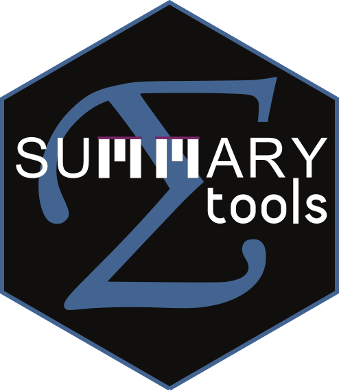

# summarytools <a href='https://github.com/dcomtois/summarytools'></a>

<!-- badges -->

[](https://cran.r-project.org/package=summarytools)
[](http://cran.rstudio.com/web/packages/summarytools/index.html)
[](http://cran.rstudio.com/web/packages/summarytools/index.html)
<span
class="badge-paypal"><a href="https://www.paypal.com/cgi-bin/webscr?cmd=_donations&business=HMN3QJR7UMT7S&item_name=Help+scientists,+data+scientists+and+analysts+around+the+globe&currency_code=CAD&source=url" title="Donate to this project using Paypal"></a></span>


# Motivation

**summarytools** is a an [*R*](https://www.r-project.org) package for
data cleaning, exploring, and simple reporting. The package was
developed with the following objectives in mind:

-   Provide a coherent set of easy-to-use descriptive functions that are
    akin to those included in commercial statistical software suites
    such as SAS, SPSS, and Stata
-   Offer flexibility in terms of output format & content  
-   Integrate well with commonly used software & tools for reporting
    (the [RStudio](https://www.rstudio.com/products/rstudio/) IDE,
    [Rmarkdown](https://rmarkdown.rstudio.com/), and
    [knitr](https://yihui.org/knitr/)) while also allowing for
    standalone, simple report generation from any R interface

On a more personal level, I simply wish to share with the R community
and the scientific community at large the functions I first developed
for myself, that I ultimately realized would benefit a lot of people who
are looking for the same thing I was seeking in the first place.

## Support *summarytools*’ Development

If **summarytools** helps you get things done, please consider making a
donation. In doing so, you’ll help me feel useful, but more importantly
contribute to the package’s development and help other people like you
who benefit from its current and *future features*. I regularly receive
feature requests, and when I receive donations, I set aside some time to
work on them, making summarytools even more relevant for data
scientists, students and researchers around the world. And no matter how
small the amount is, I always appreciate the gesture.

<a href="https://www.paypal.com/cgi-bin/webscr?cmd=_donations&business=HMN3QJR7UMT7S&item_name=Help+scientists,+data+scientists+and+analysts+around+the+globe&currency_code=CAD&source=url"></a>

# Package Documentation

The bulk of the technical documentation can now be found in the
following vignettes:

### Introduction to summarytools

[see it on
CRAN](https://cran.r-project.org/web/packages/summarytools/vignettes/Introduction.html)
\| [See it on
GitHub](https://htmlpreview.github.io/?https://github.com/dcomtois/summarytools/blob/master/vignettes/Introduction.html)

### Summarytools in R Markdown

(Formerly titles as “Recommendations for Using summarytools in
Rmarkdown”) [See it on
CRAN](https://cran.r-project.org/web/packages/summarytools/vignettes/summarytools-in-rmarkdown.html)
\| [See it on
GitHub](https://htmlpreview.github.io/?https://github.com/dcomtois/summarytools/blob/master/vignettes/summarytools-in-rmarkdown.html)

### [CRAN-Generated Pdf Manual](https://cran.r-project.org/web/packages/summarytools/summarytools.pdf)

# Installing summarytools

### Required Software

Additional software is used by **summarytools** to fine-tune graphics as
well as offer interactive features. If installing **summarytools** for
the first time, click on the link corresponding to your Operating System
to get detailed instructions. Note that on Windows, no additional
software is required.

<a href="#required-mac-os">Mac OS X</a>  
<a href="#required-debian">Ubuntu / Debian / Mint</a>  
<a href="#required--older-ubuntu">Older Ubuntu (14 and 16)</a>  
<a href="#required-fedora">Fedora / Red Hat / CentOS</a>  
<a href="#required-solaris">Solaris</a>

### Installing From GitHub

This method has the advantage of benefiting from minor fixes and
improvements that are added between CRAN releases. Its main drawback is
that you won’t be noticed when a new version is available. You can
either check this page from time to time, or best, use a package that
checks for package updates on various repositories, such as
[dtupdate](https://github.com/hrbrmstr/dtupdate) and
[Drat](https://dirk.eddelbuettel.com/code/drat.html)

``` r
install.packages("remotes")        # Using devtools is also possible
library(remotes)
install_github("rapporter/pander") # Strongly recommended
install_github("dcomtois/summarytools", build_vignettes = TRUE)
```

### Installing From CRAN

CRAN versions are stable but are not updated as often as the GitHub
versions. On the plus side, they can be easier to install on some
systems.

``` r
install.packages("summarytools")
```

## What’s New in Version 1.0.0

-   Heading elements are now omitted when corresponding defined keyword
    is set to ” ” (empty string), making headings even more flexible
-   Improved functionality for customized terms and translations (see
    the [Intro
    vignette](https://cran.r-project.org/web/packages/summarytools/vignettes/Introduction.html)
    for details)  
-   `dfSummary()` tables are better aligned horizontally (categories >\>
    counts >\> charts)  
-   `dfSummary()` now handles list-type columns as well as *Inf* values
-   Introductory vignette is easier to navigate

# 13. Additional Software Installations

### <a id="required-mac-os"></a>Required Software on Mac OS

**[Magick++](https://imagemagick.org/Magick++/)**

Open a terminal window and enter the following:

`brew install imagemagick@6`

If you do not have **brew** installed, simply enter this command in the
terminal:

`/usr/bin/ruby -e "$(curl -fsSL https://raw.githubusercontent.com/Homebrew/install/master/install)"`

**[XQuartz](https://www.xquartz.org/)**

If you’re using Mac OS X version 10.8 (Mountain Lion) or more recent
versions, you’ll need to download the *.dmg* image from
[xquartz.org](https://www.xquartz.org/) and add it to your Applications
folder.

<a href="#installing-from-github">Back to installation instructions</a>

### <a id="required-debian"></a>Required Software for Debian / Ubuntu / Linux Mint

**[Magick++](https://imagemagick.org/Magick++/)**  
`sudo apt install libmagick++-dev`

<a href="#installing-from-github">Back to installation instructions</a>

### <a id="required-older-ubuntu"></a>Required Software for Older Ubuntu Versions

This applies only if you are using Ubuntu Trusty (14.04) or Xenial
(16.04).

**[Magick++](https://imagemagick.org/Magick++/)**

    sudo add-apt-repository -y ppa:opencpu/imagemagick
    sudo apt-get update
    sudo apt-get install -y libmagick++-dev

<a href="#installing-from-github">Back to installation instructions</a>

### <a id="required-fedora"></a>Required Software for Fedora / Red Had / CentOS

**[Magick++](https://imagemagick.org/Magick++/)**  
`sudo yum install ImageMagick-c++-devel`

<a href="#installing-from-github">Back to installation instructions</a>

### <a id="required-solaris"></a>Required Software for Solaris

**[Magick++](https://imagemagick.org/Magick++/)**

    pkgadd -d http://get.opencsw.org/now
    /opt/csw/bin/pkgutil -U
    /opt/csw/bin/pkgutil -y -i imagemagick 
    /usr/sbin/pkgchk -L CSWimagemagick

<a href="#installing-from-github">Back to installation instructions</a>

# 14. Conclusion

The package comes with no guarantees. It is a work in progress and
feedback is always welcome. Please open an [issue on
GitHub](https://github.com/dcomtois/summarytools/issues) if you find a
bug or wish to submit a feature request.

### Stay Up to Date, and Get Involved!

For a preview of what’s coming in the next release, have a look at the
[development
branch](https://github.com/dcomtois/summarytools/tree/dev-current).

So far, I’ve worked a lot on my own on this project. Now I need your
help to make it more of a collective effort. Check out the Wiki and
don’t hesitate to post in the Discussions section.

# <a id="sponsors"></a>15. Sponsors

A big thanks to people who made donations!

-   Ashirwad Barnwal  
-   David Thomas  
-   Peter Nilsson  
-   Ross Dunne  
-   Igor Rubets  
-   Joerg Sahlmann

If **summarytools** helps you get your work done, please consider making
a donation. In doing so, you’ll help me feel useful, but more
importantly contribute to the package’s development and help other
people like you who benefit from its current and *future features*.

<a href="https://www.paypal.com/cgi-bin/webscr?cmd=_donations&business=HMN3QJR7UMT7S&item_name=Help+scientists,+data+scientists+and+analysts+around+the+globe&currency_code=CAD&source=url"></a>
