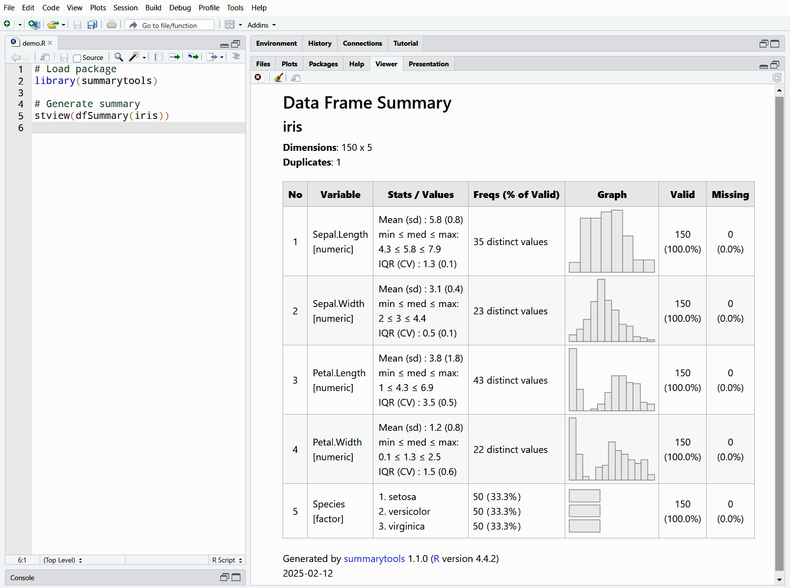
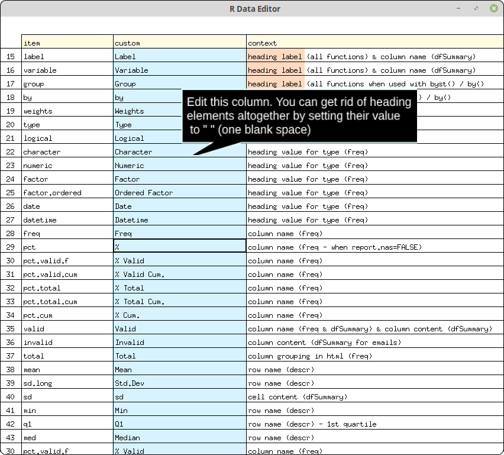

```{r setup, include=FALSE}
library(knitr)
opts_chunk$set(comment = NA,
               prompt  = FALSE,
               cache   = FALSE,
               results = 'asis')
library(kableExtra)
library(summarytools)
library(magrittr)
st_options(plain.ascii = FALSE,
           style       = "rmarkdown",
           footnote    = NA,
           subtitle.emphasis = FALSE,
           lang = "en")
```

```{r, echo=FALSE}
st_css(main = TRUE, global = TRUE, bootstrap = FALSE)
```

<a id="s-1"></a>  

# 1. Overview {#overview}

**summarytools** provides a coherent set of functions centered on data
exploration and simple reporting. At its core reside the following four
functions:


```{r, results='asis', echo=FALSE}
txt <- data.frame(
  Function = 
    c('<a href="#freq"><strong><code>freq()</strong></code></a>',
      '<a href="#ctable"><strong><code>ctable()</strong></code></a>',
      '<a href="#descr"><strong><code>descr()</strong></code></a>',
      '<a href="#dfsummary"><strong><code>dfSummary()</strong></code></a>'),
  Description = 
    c(paste("**Frequency Tables** featuring counts, proportions, cumulative",
             "statistics as well as missing data reporting"),
      paste("**Cross-Tabulations** (joint frequencies) between pairs",
            "of discrete/categorical variables, featuring marginal sums",
            "as well as row, column or total proportions"),
      paste("**Descriptive (Univariate) Statistics** for numerical data, featuring",
            "common measures of central tendency and dispersion"),
      paste("**Data Frame Summaries** featuring type-specific",
            "information for all variables: univariate",
            "statistics and/or frequency distributions, bar charts or",
            "histograms, as well as missing data counts and proportions.",
            "Very useful to quickly, detect anomalies and identify trends",
            "at a glance"))
)

kable(txt, format = "html", escape = FALSE, align = c('l', 'l')) %>%
  kable_paper(full_width = FALSE, position = "left") %>%
  column_spec(1, extra_css = "vertical-align:top") %>%
  column_spec(2, extra_css = "vertical-align:top")
```

## 1.1 Motivation

The package was developed with the following objectives in mind:

 - Provide a coherent set of easy-to-use descriptive functions that are
   akin to those included in commercial statistical software suites such as
   SAS, SPSS, and Stata 
 - Offer flexibility in terms of output format & content  
 - Integrate well with commonly used software & tools for reporting
   (the [RStudio](https://www.rstudio.com/products/rstudio/) IDE,
   [Rmarkdown](https://rmarkdown.rstudio.com/), and 
   [knitr](https://yihui.org/knitr/)) while also allowing for standalone,
   simple report generation using any R interface

## 1.2 Directing Output

Results can be

 - Displayed in the *R* console as plain text 
 - Rendered as *html* and shown in a Web browser or in RStudio's Viewer Pane 
 - Written / appended to plain text, *markdown*, or *html* files 
 
**When creating _R Markdown_ documents**, make sure to 

  - Use chunk option`result="asis"`
  - Une the function argument `plain.ascii=FALSE` 
  - Set the *style* parameter to "rmarkdown", or "grid" for `dfSummary()`

  
## 1.3 Other Characteristics

 - **Weights-enabled**: `freq()`, `ctable()` and `descr()` support sampling
   weights 
 - **Multilingual**: 
   + Built-in translations exist for French, Portuguese, Spanish, Russian, and
     Turkish. Users can easily add custom translations or modify existing ones
     as needed 
 - **Flexible and extensible**: 
   + The built-in features used to support alternate languages provide a way to
     modify a great number of terms used in outputs (headings and tables) 
   + **Pipe operators** from
     [magrittr](https://cran.r-project.org/package=magrittr) (`%>%`, `%$%`) and
     [pipeR](https://cran.r-project.org/package=pipeR) (`%>>%`) are fully
     supported; the native `|>` introduced in R 4.0 is supported as well 
   + Default values for a good number of function parameters can be modified
     using `st_options()` to minimize redundancy in function calls 
   + **By-group processing** is easily achieved using the package's `stby()`
     function which is a slightly modified version of base `base::by()`, but
     `dplyr::group_by()` is also supported 
   + [**Pander options**](http://rapporter.github.io/pander/) can be used to
     customize or enhance plain text and markdown tables 
   + Base R's `format()` parameters are also supported; this can be used to set
     thousands separator or modify the decimal separator, among several other
     possibilities (see `help("format")`)
   + [**Bootstrap CSS**](https://getbootstrap.com/) is used by default with
     *html* output, and user-defined classes can be added at will 

<br/>
<div style="width:100%; margin:0 auto; text-align:center">
<a href="#s-1"><< 1. Overview</a> |
<a href="#header">TOC</a> |
<a href="#s-3">3. Cross-Tabulations: ctable() >></a> 
</div>
<br/><br/>
<a id="s-2"></a><a id="freq"></a>  

# 2. Frequency Tables: freq()  
 
The `freq()` function generates **frequency tables** with counts,
proportions, as well as missing data information. Side note: the very idea
for creating this package stemmed from the absence of such a function in
base R. 

```{r}
freq(iris$Species, plain.ascii = FALSE, style = "rmarkdown")
```

In this first example, the `plain.ascii` and `style` arguments were
specified. However, since we have defined them globally for this document
using `st_options()`, they are redundant and will be omitted from hereon
(<a href="#setup">section 16</a> contains a detailed description of this
vignette's configuration).

## 2.1 Missing Data 

One of **summarytools**' main purposes is to help cleaning and preparing data
for further analysis. But in some circumstances, we don't need (or already have)
information about missing data. Using `report.nas = FALSE` makes the output
table smaller by one row and two columns:

```{r}
freq(iris$Species, report.nas = FALSE, headings = FALSE)
```

<table><tr><td></td>
<td>The `headings = FALSE` parameter suppresses the heading section.
</td></tr></table>

## 2.2 Simplest Expression 

By "switching off" all optional elements, a much simpler table will be produced:

```{r}
freq(iris$Species, 
     report.nas = FALSE, 
     totals     = FALSE, 
     cumul      = FALSE, 
     headings   = FALSE)
```

While the output is much simplified, the syntax is not; I blame it on
Tesler's [law of conservation of complexity](https://en.wikipedia.org/wiki/Law_of_conservation_of_complexity)!
Thankfully, `st_options()` is there to accommodate everyone's preferences (see
[section on package options](#st-options)).

<a id="multiple-freq-tables"></a>  

## 2.3 Multiple Frequency Tables At Once  

To generate frequency tables for all variables in a data frame, we *could*
(and in the earliest versions, *needed* to) use `lapply()`. However, this
is not required since `freq()` accepts data frames as the main argument:

```{r, eval=FALSE}
freq(tobacco)
```

To avoid cluttering the results, *numerical* columns having more
than 25 distinct values are ignored. This threshold of 
25 can be changed by using `st_options()`; for example, to change it to 10,
we'd use `st_options(freq.ignore.threshold = 10)`.

<table><tr><td></td>
<td>The *tobacco* data frame contains simulated data and is
included in the package. Another simulated data frame is included: *exams*.
Both have French versions (*tabagisme*, *examens*).</td></tr></table>


## 2.4 Subsetting (Filtering) Frequency Tables

The `rows` parameter allows subsetting frequency tables; we can
use this parameter in different ways:

 - To filter rows by their order of appearance, we use a numerical vector;
   `rows = 1:10` will show the frequencies for the first 10 values only. To
   account for the frequencies of unshown values, the “(Other)” row is
   automatically added 
 - To filter rows by name, we can use either 
   + a character vector specifying all the row names we wish to keep   
   + a single character string, which will be used as a regular expression 
     (see `?regex` for more information on this topic)  

### Showing The Most Common Values 

By combining the `order` and `rows` parameters, we can easily filter
the results to show, for example, the 5 most common values in a factor:

```{r}
freq(tobacco$disease, 
     order    = "freq",
     rows     = 1:5,
     headings = FALSE)
```

Instead of `"freq"`, we can use `"-freq"` to reverse the ordering and
get results ranked from lowest to highest in frequency. 

<table><tr><td></td>
<td>Notice the "**(Other)**" row, which is automatically generated.</td></tr></table> 

## 2.5 Collapsible Sections

When generating *html* results, use the `collapse = TRUE` argument with
`print()` or `view()` / `stview()` to get collapsible sections; clicking
on the variable name in the heading section will collapse / reveal the 
frequency table (results not shown).

```{r, eval=FALSE}
view(freq(tobacco), collapse = TRUE)
```

<br/>
<div style="width:100%; margin:0 auto; text-align:center">
<a href="#s-2"><< 2. Frequency Tables: freq()</a> | 
<a href="#header">TOC</a> | 
<a href="#s-4">4. Descriptive Statistics: descr() >></a>
</div>
<br/><br/>
<a id="s-3"></a><a id="ctable"></a> 

# 3. Cross-Tabulations: ctable()  

`ctable()` generates cross-tabulations (joint frequencies) for
pairs of categorical variables. 

Using the *tobacco* simulated data frame, we'll cross-tabulate the two
categorical variables *smoker* and *diseased*.


```{r}
ctable(x = tobacco$smoker, 
       y = tobacco$diseased, 
       prop = "r")   # Show row proportions
```

As can be seen, since *markdown* does not fully support multiline table
headings, **pander** does what it can to display this particular type of
table. To get better results, the "render" method is recommended and will
be used in the next examples.


## 3.1 Row, Column, or Total Proportions

Row proportions are shown by default. To display *column* or *total*
proportions, use `prop = "c"` or `prop = "t"`, respectively. To omit
proportions altogether, use `prop = "n"`.

## 3.2 Minimal Cross-Tabulations

By "switching off" all optional features, we get a simple “2 x 2” table:

```{r}
with(tobacco, 
     print(ctable(x = smoker, 
                  y = diseased, 
                  prop     = 'n',
                  totals   = FALSE, 
                  headings = FALSE),
           method = "render")
)
```

## 3.3 Chi-Square (&#120536;<sup>2</sup>), Odds Ratio and Risk Ratio

To display the chi-square statistic, set `chisq = TRUE`. For
*2 x 2* tables, use `OR` and `RR` to show odds ratio and
risk ratio (also called relative risk), respectively. Those can
be set to `TRUE`, in which case 95% confidence intervals are
shown; to use different confidence levels, use for example `OR = .90`. 

<table><tr><td></td>
<td>Using pipes generally makes it easier to generate `ctable()` results.</td>
</tr></table>


```{r}
library(magrittr)
tobacco %$%  # Acts like with(tobacco, ...)
  ctable(x = smoker, y = diseased,
         chisq = TRUE,
         OR    = TRUE,
         RR    = TRUE,
         headings = FALSE) %>%
  print(method = "render")
```

<br/>
<div style="width:100%; margin:0 auto; text-align:center">
<a href="#s-3"><< 3. Cross-Tabs: ctable()</a> | 
<a href="#header">TOC</a> | 
<a href="#s-5">5. Data Frame Summaries: dfSummary() >></a> 
</div>
<br/><br/>
<a id="s-4"></a><a id="descr"></a>  

# 4. Descriptive Statistics: descr()  

`descr()` generates descriptive / univariate statistics, *i.e.* common central
tendency statistics and measures of dispersion. It accepts single
vectors as well as data frames; in the latter case, all non-numerical columns
are ignored, with a message to that effect. 

```{r}
descr(iris)
```

To turn off the variable-type messages, use `silent = TRUE`. It is possible to
set that option globally, which we will do here, so it won't be
displayed in the remaining of this vignette.

```{r}
st_options(descr.silent = TRUE)
```


## 4.1 Transposing and Selecting Statistics

Results can be transposed by using `transpose = TRUE`, and statistics
can be selected using the `stats` argument:

```{r}
descr(iris,
      stats     = c("mean", "sd"),
      transpose = TRUE,
      headings  = FALSE)
```

See `?descr` for a list of all available statistics. Special values 
“all”, “fivenum”, and “common” are also valid. The default value is “all”, 
and it can be modified using `st_options()`:

```{r, eval=FALSE}
st_options(descr.stats = "common")
```

<br/>
<div style="width:100%; margin:0 auto; text-align:center">
<a href="#s-4"><< 4. Descriptive Statistics with descr()</a> | 
<a href="#header">TOC</a> | 
<a href="#s-6">6. Grouped Statistics: stby() >></a> 
</div>
<br/><br/>
<a id="s-5"></a><a id="dfsummary"></a>  

# 5. Data Frame Summaries: dfSummary()  

`dfSummary()` creates a summary table with statistics, frequencies and graphs
for all variables in a data frame. The information displayed is
type-specific (character, factor, numeric, date) and also varies according to
the number of distinct values.

To see the results in RStudio's Viewer (or in the default Web browser if
working in another IDE or from a terminal window), use the `view()` function,
or its twin `stview()` in case of name conflicts:

```{r, eval=FALSE}
view(dfSummary(iris))
```



<table><tr><td></td>
<td> Be careful to use `view()` and not `View()`. If you use the latter, results
will be shown in the data viewer. 

Also, be mindful of the order in which
the packages are loaded. Some packages redefine `view()` to point to `View()`;
loading **summarytools** *after* these packages will ensure its own `view()`
works properly. Otherwise, `stview()` is always there as a foolproof 
alternative.</td></tr></table>


## 5.1 Using dfSummary() in R Markdown Documents

When using `dfSummary()` in *R Markdown* documents, it is generally a good 
idea to exclude a column or two to avoid margin overflow. Since the *Valid*
and *Missing* columns are redundant, we can drop either one of them.

```{r, eval=FALSE}
dfSummary(tobacco, 
          plain.ascii  = FALSE, 
          style        = "grid", 
          graph.magnif = 0.75, 
          valid.col    = FALSE,
          tmp.img.dir  = "/tmp")
```

 
<br/>

**The `tmp.img.dir` parameter is mandatory** when generating *dfSummaries* in
*R Markdown* documents, except for _html_ rendering. The 
explanation for this can be found [further below](#tmp-img-dir). 


<table><tr><td></td>
<td>Some users reported repeated X11 warnings; those can be avoided by setting
the `warning` chunk option to `FALSE`: `{r chunk_name, results="asis", warning=FALSE}`. 
</td></tr></table> 


## 5.2 Optional Statistics

This feature has been requested several times since the package was
released. Introduced in version 1.0.0, it provides control over which
statistics to shown in the *Stats/Values* column. Namely, the third row,
which displays `IQR (CV)`, can be modified to show any available
statistics in R. An additional "slot" (unused by default) is also made
available. To use this feature, define `dfSummary.custom.1` and/or
`dfSummary.custom.2` using `st_options()` in the following way, encapsulating
the code in an `expression()`:


```{r}
st_options(
  dfSummary.custom.1 = 
    expression(
      paste(
        "Q1 - Q3 :",
        round(
          quantile(column_data, probs = .25, type = 2, 
                   names = FALSE, na.rm = TRUE), digits = 1
        ), " - ",
        round(
          quantile(column_data, probs = .75, type = 2, 
                   names = FALSE, na.rm = TRUE), digits = 1
        )
      )
    )
)

print(
  dfSummary(iris, 
            varnumbers   = FALSE,
            na.col       = FALSE,
            style        = "multiline",
            plain.ascii  = FALSE,
            headings     = FALSE,
            graph.magnif = .8),
  method = "render"
)
```


If we had used `dfSummary.custom.2` instead of `dfSummary.custom.1`,
a fourth row would have been added under the default `IQR (CV)` row.

Note that instead of `round()`, it is possible to use the internal 
`format_number()`, which ensures the number is formatted according to all
specified arguments (rounding digits, decimal mark and thousands mark, etc.).
The internal variable `round.digits` which contains the value of
`st_options("round.digits")` can also be used. This is how the
default `IQR (CV)` is defined -- here we set the first custom stat back
to its default value and then display its definition (`formatR::tidy_source()`
is used to format / indent the expression):

```{r, results='markup'}
library(formatR)
st_options(dfSummary.custom.1 = "default")
formatR::tidy_source(
  text   = deparse(st_options("dfSummary.custom.1")),
  indent = 2,
  args.newline = TRUE
)
```

<table><tr><td></td>
<td>Don't forget to specify `na.rm = TRUE` for all functions that use this
parameter (most of base R functions do).</td></tr></table>


## 5.3 Other Notable Features

The `dfSummary()` function also

 - Reports the number of duplicate records in the heading section  
 - Detects UPC/EAN codes (barcode numbers) and doesn't calculate irrelevant
   statistics for them  
 - Detects email addresses and reports counts of valid, invalid and
   duplicate addresses; note that the proportions of valid and invalid
   sum up to 100%; the duplicates proportion is calculated independently,
   which is why in the bar chart (*html* version), the bar for this
   category is shown with a different color 
 - Allows the display of "windowed" results by using the `max.tbl.height`
   parameter; This is especially convenient if the analyzed data frame has
   numerous variables; see 
   `vignette("rmarkdown", package = "summarytools")` for more details

## 5.4 Excluding Columns

Although most columns can be excluded using the function's parameters, it
is also possible to delete them with the following syntax (results not shown):

```{r, eval=FALSE}
dfs <- dfSummary(iris)
dfs$Variable <- NULL # This deletes the "Variable" column
```

<br/>
<div style="width:100%; margin:0 auto; text-align:center">
<a href="#s-5"><< 5. Data Frame Summaries</a> | 
<a href="#header">TOC</a> | 
<a href="#s-7">7. Grouped Statistics: group_by() >></a> 
</div>
<br/><br/>
<a id="s-6"></a>  

# 6. Grouped Statistics: stby() 

To produce optimal results, **summarytools** has its own version of
the base `by()` function. It's called `stby()`, and we use it exactly as we
would `by()`:

```{r}
(iris_stats_by_species <- stby(data      = iris, 
                               INDICES   = iris$Species, 
                               FUN       = descr, 
                               stats     = "common", 
                               transpose = TRUE))
```

## 6.1 Special Case of descr() with stby()

When used to produce split-group statistics for a single variable, `stby()`
assembles everything into a single table instead of displaying a series
of one-column tables.

```{r}
with(tobacco, 
     stby(data    = BMI, 
          INDICES = age.gr, 
          FUN     = descr,
          stats   = c("mean", "sd", "min", "med", "max"))
)
```

## 6.2 Using stby() with ctable()

The syntax is a little trickier for this combination, so here is an example
(results not shown):

```{r, eval=FALSE}
stby(data    = list(x = tobacco$smoker, y = tobacco$diseased), 
     INDICES = tobacco$gender, 
     FUN     = ctable)

# or equivalently
with(tobacco, 
     stby(data    = list(x = smoker, y = diseased), 
          INDICES = gender, 
          FUN     = ctable))
```

<br/>
<div style="width:100%; margin:0 auto; text-align:center">
<a href="#s-6"><< 6. Grouped Statistics : group_by()</a> | 
<a href="#header">TOC</a> | 
<a href="#s-8">8. Tidy Tables : tb() >></a>
</div>
<br/><br/>
<a id="s-7"></a>  

# 7. Grouped Statistics: group_by()

To create grouped statistics with `freq()`, `descr()` or `dfSummary()`, it is
possible to use **dplyr**'s `group_by()` as an alternative to `stby()`.
Syntactic differences aside, one key distinction is that `group_by()` considers
`NA` values on the grouping variable(s) as a valid category, albeit with a
warning suggesting the use of `forcats::fct_explicit_na` to make `NA`'s explicit
in factors. Following this advice, we get:

```{r, eval=FALSE}
library(dplyr)
tobacco$gender %<>% forcats::fct_explicit_na()
tobacco %>% 
  group_by(gender) %>% 
  descr(stats = "fivenum")
```

```{r, echo=FALSE}
suppressPackageStartupMessages(library(dplyr))
library(magrittr)
tobacco$gender %<>% forcats::fct_explicit_na()
tobacco %>% group_by(gender) %>% descr(stats = "fivenum")
```

<br/>
<div style="width:100%; margin:0 auto; text-align:center">
<a href="#s-7"><< 7. Grouped Statistics : group_by()</a> | 
<a href="#header">TOC</a> | 
<a href="#s-9">9. Directing Output to Files >></a> 
</div>
<br/><br/>
<a id="s-8"></a>  

# 8. Tidy Tables : tb()

When generating `freq()` or `descr()` tables, it is possible to turn the
results into "tidy" tables with the use of the `tb()` function (think of
*tb* as a diminutive for *tibble*). For example:

```{r, results='markup'}
library(magrittr)
iris %>%
  descr(stats = "common") %>%
  tb()

iris$Species %>% 
  freq(cumul = FALSE, report.nas = FALSE) %>% 
  tb()
```

By definition, no total rows are part of *tidy* tables, and the row
names are converted to a regular column. 

<table><tr><td></td>
<td>When displaying *tibbles* using **rmarkdown**, the **knitr** chunk option
`results` should be set to 'markup' instead of 'asis'.</td></tr></table>


## 8.1 Tidy Split-Group Statistics

Here are some examples showing how lists created using `stby()` or `group_by()` 
can be transformed into *tidy tibbles*.

```{r, results='markup'}
grouped_descr <- stby(data    = exams,
                      INDICES = exams$gender, 
                      FUN     = descr,
                      stats   = "common")

grouped_descr %>% tb()
```

The `order` parameter controls row ordering:
```{r, results='markup'}
grouped_descr %>% tb(order = 2)
```

Setting `order = 3` changes the order of the sort variables exactly as with
`order = 2`, but it also reorders the columns:

```{r, results='markup'}
grouped_descr %>% tb(order = 3)
```

For more details, see `?tb`.

## 8.2 A Bridge to Other Packages 

**summarytools** objects are not always compatible with packages
focused on table formatting, such as
[formattable](https://CRAN.R-project.org/package=formattable) or
[kableExtra](https://CRAN.R-project.org/package=kableExtra).
However, `tb()` can be used as a "bridge", an intermediary step
turning `freq()` and `descr()` objects into simple tables that any
package can work with. Here is an example using **kableExtra**:

```{r, results='asis'}
library(kableExtra)
library(magrittr)
stby(data    = iris, 
     INDICES = iris$Species, 
     FUN     = descr, 
     stats   = "fivenum") %>%
  tb(order = 3) %>%
  kable(format = "html", digits = 2) %>%
  collapse_rows(columns = 1, valign = "top")
```

<br/>
<div style="width:100%; margin:0 auto; text-align:center">
<a href="#s-8"><< 8. Tidy Tables : tb()</a> | 
<a href="#header">TOC</a> | 
<a href="#s-10">10. Global Options >></a> 
</div>
<br/><br/>
<a id="s-9"></a>  

# 9. Directing Output to Files

Using the `file` argument with `print()` or `view()` / `stview()`, we can
write outputs to a file, be it *html*, *Rmd*, *md*, or just plain text
(*txt*). The file extension is used by the package to determine the type of
content to write out.

```{r, eval=FALSE}
view(iris_stats_by_species, file = "~/iris_stats_by_species.html")
view(iris_stats_by_species, file = "~/iris_stats_by_species.md")
```

**A Note on *PDF*  documents**

There is no direct way to create a *PDF* file with **summarytools**. One
option is to generate an *html* file and convert it to *PDF* using 
[Pandoc](https://pandoc.org) or
[WK\<html\>TOpdf](https://wkhtmltopdf.org/index.html) (the latter gives
better results than *Pandoc* with `dfSummary()` output). 

Another option is to create an *Rmd* document using *PDF* as the output
format. See `vignette("rmarkdown", package = "summarytools")` for the details
on how to proceed.

## 9.1 Appending Output Files

The `append` argument allows adding content to existing files generated by
**summarytools**. This is useful if we wish to include several statistical
tables in a single file. It is a quick alternative to creating an *Rmd*
document.

<br/>
<div style="width:100%; margin:0 auto; text-align:center">
<a href="#s-9"><< 9. Directing Output to Files</a> | 
<a href="#header">TOC</a> | 
<a href="#s-11">11. Format Attributes >></a> 
</div>
<br/><br/>
<a id="s-10"></a><a id="st-options"></a>  

# 10. Package Options

The following options can be set globally with `st_options()`:

## 10.1 General Options

| Option name                   | Default   | Note                                            |
| ----------------------------: | --------: | :---------------------------------------------- |
| style <sup>(1)</sup>          | “simple”  | Set to “rmarkdown” in .Rmd documents            |
| plain.ascii                   |    TRUE   | Set to FALSE in .Rmd documents                  |
| round.digits <sup>(2)</sup>   |       2   | Number of decimals to show                      |
| headings                      |    TRUE   | Formerly “omit.headings”                        |
| footnote                      | “default” | Customize or set to NA to omit                  |
| display.labels                |    TRUE   | Show variable / data frame labels in headings   |
| bootstrap.css <sup>(3)</sup>  |    TRUE   | Include Bootstrap 4 CSS in *html* output files  |
| custom.css                    |      NA   | Path to your own CSS file                       |
| escape.pipe                   |   FALSE   | Useful for some Pandoc conversions              |
| char.split <sup>(4)</sup>     |      12   | Threshold for line-wrapping in column headings  |
| subtitle.emphasis             |    TRUE   | Controls headings formatting                    |
| lang                          |   “en”    | Language (always 2-letter, lowercase)           |

^1^ Does not apply to `dfSummary()`, which has its own style option (see next table)  
^2^ Does not apply to `ctable()`, which has its own `round.digits` option (see next table)  
^3^ Set to `FALSE` in _Shiny_ apps  
^4^ Affects only *html* outputs for `descr()` and `ctable()`  

## 10.2 Function-Specific Options

| Option name               |     Default | Note                                     |
| ------------------------: | ----------: | :--------------------------------------- |
| freq.cumul                |      TRUE   | Display cumulative proportions in freq() |
| freq.totals               |      TRUE   | Display totals row in freq()             |
| freq.report.nas           |      TRUE   | Display <NA> row and “valid” columns     |
| freq.ignore.threshold <sup>(1)</sup> |        25   | Used to determine which vars to ignore   |
| freq.silent               |     FALSE   | Hide console messages                    |
| ctable.prop               |       “r”   | Display **r**ow proportions by default   |
| ctable.totals             |      TRUE   | Show marginal totals                     |
| ctable.round.digits       |         1   | Number of decimals to show in `ctable()` |
| descr.stats               |      “all”  | “fivenum”, “common” or vector of stats   |
| descr.transpose           |     FALSE   | Display stats in columns instead of rows |
| descr.silent              |     FALSE   | Hide console messages                    |
| dfSummary.style           | “multiline” | Can be set to “grid” as an alternative   |
| dfSummary.varnumbers      |      TRUE   | Show variable numbers in 1st col.        |
| dfSummary.labels.col      |      TRUE   | Show variable labels when present        |
| dfSummary.graph.col       |      TRUE   | Show graphs                              |
| dfSummary.valid.col       |      TRUE   | Include the Valid column in the output   |
| dfSummary.na.col          |      TRUE   | Include the Missing column in the output |
| dfSummary.graph.magnif    |         1   | Zoom factor for bar plots and histograms |
| dfSummary.silent          |     FALSE   | Hide console messages                    |
| tmp.img.dir <sup>(2)</sup>|        NA   | Directory to store [temporary images](#tmp-img-dir) |
| use.x11 <sup>(3)</sup>    |      TRUE   | Allow creation of Base64-encoded graphs  |

^1^ See <a href="#multiple-freq-tables">section 2.3</a> for details  
^2^ Applies to `dfSummary()` only  
^3^ Set to FALSE in text-only environments  


### Examples 

```{r, eval=FALSE}
st_options()                      # Display all global options values
st_options('round.digits')        # Display the value of a specific option
st_options(style = 'rmarkdown',   # Set the value of one or several options
           footnote = NA)         # Turn off the footnote for all html output
```

<br/>
<div style="width:100%; margin:0 auto; text-align:center">
<a href="#s-10"><< 10. Global Options</a> | 
<a href="#header">TOC</a> | 
<a href="#s-12">12. Fine-Tuning Looks : CSS >></a> 
</div>
<br/><br/>
<a id="s-11"></a>  

# 11. Format Attributes

When a **summarytools** object is created, its formatting attributes are
stored within it. However, we can override most of them when using
`print()` or `view()`.

## 11.1 Overriding Function-Specific Arguments

The following table indicates what arguments can be used with `print()`
or `view()` to override formatting attributes. Base R's `format()`
function arguments can also be used (although they are not listed here).


| Argument                    | freq   | ctable | descr | dfSummary |
| --------------------------: | :----: | :----: | :---: | :-------: |
| style                       |   x    |   x    |   x   |     x     |
| round.digits                |   x    |   x    |   x   |           |
| plain.ascii                 |   x    |   x    |   x   |     x     |
| justify                     |   x    |   x    |   x   |     x     |
| headings                    |   x    |   x    |   x   |     x     |
| display.labels              |   x    |   x    |   x   |     x     |
| varnumbers                  |        |        |       |     x     |
| labels.col                  |        |        |       |     x     |
| graph.col                   |        |        |       |     x     |
| valid.col                   |        |        |       |     x     |
| na.col                      |        |        |       |     x     |
| col.widths                  |        |        |       |     x     |
| totals                      |   x    |   x    |       |           |
| report.nas                  |   x    |        |       |           |
| display.type                |   x    |        |       |           |
| missing                     |   x    |        |       |           |
| split.tables <sup>(1)</sup> |   x    |   x    |   x   |     x     |
| caption <sup>(1)</sup>      |   x    |   x    |   x   |     x     |

^1^ _pander_ options

## 11.2 Overriding Heading Contents

To change the information shown in the heading section,
use the following arguments with `print()` or `view()`:

| Argument           | freq   | ctable | descr | dfSummary |
| -----------------: | :----: | :----: | :---: | :-------: |
| Data.frame         |   x    |   x    |   x   |     x     |
| Data.frame.label   |   x    |   x    |   x   |     x     |
| Variable           |   x    |   x    |   x   |           |
| Variable.label     |   x    |   x    |   x   |           |
| Group              |   x    |   x    |   x   |     x     |
| date               |   x    |   x    |   x   |     x     |
| Weights            |   x    |        |   x   |           |
| Data.type          |   x    |        |       |           |
| Row.variable       |        |   x    |       |           |
| Col.variable       |        |   x    |       |           |


### Example

In the following example, we will create and display a `freq()` object, and
then display it again, this time overriding three of its formatting attributes,
as well as one of its heading attributes.

```{r}
(age_stats <- freq(tobacco$age.gr)) 
print(age_stats,
      report.nas     = FALSE, 
      totals         = FALSE, 
      display.type   = FALSE,
      Variable.label = "Age Group")
```

## 11.3 Order of Priority for Parameters / Options

1.  `print()` or `view()` parameters have precedence (overriding feature)  
2.  `freq() / ctable() / descr() / dfSummary()` parameters come second  
3.  Global options set with `st_options()` come third and act as default 


The logic for the evaluation of the various parameter values can be summarized
as follows:

- If an argument is explicitly supplied in the function call, it will have
  precedence over any stored value for the parameter (stored values are the 
  ones that are written to the object's attributes when using a core 
  function, as well as the ones stored in **summarytools**' global options
  list). 

- If both a core function and the print or view function are called at once and
  have conflicting parameter values, print/view has precedence (they always
  win the argument!).

- if the parameter values cannot be found in the function calls, the stored
  defaults (modified with `st_options()` or left as they are when
  loading the package) will be applied.

<br/>
<div style="width:100%; margin:0 auto; text-align:center">
<a href="#s-11"><< 11. Format Attributes</a> | 
<a href="#header">TOC</a> | 
<a href="#s-13">13. <em>Shiny</em> Apps >></a> 
</div>
<br/><br/>
<a id="s-12"></a>  

# 12. Fine-Tuning Looks : CSS

When creating *html* reports, both [Bootstrap](https://getbootstrap.com/)'s 
*CSS* and *summarytools.css* are included by default. For greater control
on the looks of *html* content, it is also possible to add class
definitions in a custom *CSS* file. 

### Example

We need to use a very small font size for a simple *html* report containing
a `dfSummary()`. For this, we create a *.css* file (with the name of our
choosing) which contains the following class definition:

```css
.tiny-text {
  font-size: 8px;
}
```

Then we use `print()`'s `custom.css` argument to specify to location of
our newly created *CSS* file (results not shown):

```{r, eval=FALSE}
print(dfSummary(tobacco),
      custom.css    = 'path/to/custom.css', 
      table.classes = 'tiny-text',
      file          = "tiny-tobacco-dfSummary.html")
```

<br/>
<div style="width:100%; margin:0 auto; text-align:center">
<a href="#s-12"><< 12. Fine-Tuning Looks : CSS</a> | 
<a href="#header">TOC</a> | 
<a href="#s-14">14. Graphs in R Markdown >></a> 
</div>
<br/><br/>
<a id="s-13"></a>  

# 13. *Shiny* Apps

To successfully include **summarytools** functions in *Shiny* apps,

 - use *html* rendering  
 - set `bootstrap.css = FALSE` to avoid interacting with the app's layout  
 - set `headings = FALSE` in case problems arise  
 - adjust graph sizes with the `graph.magnif` parameter or with the
   `dfSummary.graph.magnif` global option  
 - if `dfSummary()` tables are too wide, omit a column or two (`valid.col` and 
   `varnumbers`, for instance)  
 - if the results are still unsatisfactory, set column widths manually with 
   the `col.widths` parameter  
 - if `col.widths` or `graph.magnig` do not seem to work, try using them as
   parameters for `print()` rather than `dfSummary()` 

### Example (results not shown)

```{r, eval=FALSE}
print(dfSummary(somedata, 
                varnumbers   = FALSE, 
                valid.col    = FALSE, 
                graph.magnif = 0.8), 
      method   = 'render',
      headings = FALSE,
      bootstrap.css = FALSE)
```

<br/>
<div style="width:100%; margin:0 auto; text-align:center">
<a href="#s-13"><< 13. <em>Shiny</em> Apps</a> | 
<a href="#header">TOC</a> | 
<a href="#s-15">15. Languages & Term Customization >></a> 
</div>
<br/><br/>
<a id="s-14"></a>  

# 14. Graphs in R Markdown {#tmp-img-dir}

When using `dfSummary()` in an *Rmd* document using *markdown*
styling (as opposed to *html* rendering), three elements are
needed in order to display the *png* graphs properly:

  1 - `plain.ascii` must be set to FALSE  
  2 - `style` must be set to "grid"  
  3 - `tmp.img.dir` must be defined and be at most 5 characters wide  

Note that as of version 0.9.9, **setting `tmp.img.dir` is no longer required**
**when using `method = "render"`** and can be left to `NA`. It is only 
necessary to define it when a transitory markdown table must be created, as
shown below. Note how narrow the *Graph* column is -- this is actually required, 
since the width of the rendered column is determined by the number of characters
in the cell, rather than the width of the image itself:

```
+---------------+--------|----------------------+---------+
| Variable      | stats  |  Graph               | Valid   |
+===============+========|======================+=========+
| age\          |  ...   |  | 978\    |
| [numeric]     |  ...   |                      | (97.8%) |
+---------------+--------+----------------------+---------+
```

CRAN policies are really strict when it comes to writing content in the user 
directories, or anywhere outside *R's temporary zone* (for good reasons). So
users need to set this temporary location themselves, therefore consenting to
having content written outside *R*'s predefined temporary zone.

On Mac OS and Linux, using "/tmp" makes a lot of sense: it's a short path,
and the directory is purged automatically. On Windows, there is no such
convenient directory, so we need to pick one -- be it absolute ("/tmp") or
relative ("img", or simply ".").

<br/>
<div style="width:100%; margin:0 auto; text-align:center">
<a href="#s-14"><< 14. Graphs in R Markdown</a> | 
<a href="#header">TOC</a> | 
<a href="#s-16">16. Vignette Setup >></a> 
</div>
<br/><br/>
<a id="s-15"></a>  

# 15. Languages & Term Customization

Thanks to the *R* community's efforts, the following languages can be used,
in addition to English (default):

 * French (*fr*) 
 * Portuguese (*pt*) 
 * Russian (*ru*) 
 * Spanish (*es*) 
 * Turkish (*tr*) 

To switch languages, simply use 

```{r}
st_options(lang = "fr")
```

All output from the core functions will now use that language:

```{r}
freq(iris$Species)
```

## 15.1 Non-UTF-8 Locales

On most Windows systems, it is necessary to change the `LC_CTYPE` element of
the locale settings if the character set is not included in the system's
default locale. For instance, in order to get good results with the Russian
language in a "latin1" environment, use the following settings:

```{r, eval = FALSE}
Sys.setlocale("LC_CTYPE", "russian")
st_options(lang = 'ru')
```

To go back to default settings...

```{r, eval=FALSE}
Sys.setlocale("LC_CTYPE", "")
st_options(lang = "en")
```

## 15.2 Defining and Using Custom Terms

Using the function `use_custom_lang()`, it is possible to add your own set of 
translations or personalized terms. To achieve this, get the 
[csv template](https://raw.githubusercontent.com/dcomtois/summarytools/master/translations/language_template.csv),
customize one, many or all of the +/- 70 terms, and call `use_custom_lang()`,
giving it as sole argument the path to the edited *csv* template. Note that such
custom language settings will not persist across R sessions. This means that
you should always have this *csv* file handy for future use. 

## 15.3 Defining Only Specific Keywords

The `define_keywords()` makes it easy to change just one or a few terms.
For instance, you might prefer using "N" or "Count" rather than "Freq" in the
title row of `freq()` tables. Or you might want to generate a document which
uses the tables' titles as heading sections.

For this, call `define_keywords()` and feed it the term(s) you wish
to modify (which can themselves be stored in predefined variables). Here,
the terms we need to change are `freq.title` and `freq`:


```{r}
section_title <- "**Species of Iris**"
define_keywords(title.freq = section_title,
                freq = "N")
freq(iris$Species)
```

Calling `define_keywords()` without any arguments will bring up, on systems
that support graphical devices (the vast majority, that is), a window from
which we can edit all the terms we want. 



After closing the edit window, a dialogue box gives the option to save the
newly created custom language to a *csv* file (even though we changed just
a few keywords, the package considers the terms as a whole). We can later
reload into memory the custom language file by calling
`use_custom_lang("path-to-custom-language-file.csv")`.

See `?define_keywords` for a list of all customizable terms in the package.

To revert all changes, we can simply use `st_options(lang = "en")`. 

## 15.4 Power-Tweaking Headings 

It is possible to further customize the headings by adding arguments to the
`print()` function. Here, we use an empty string to override the value of 
`Variable`; this causes the second line of the heading to disappear altogether.

```{r}
define_keywords(title.freq = "Types and Counts, Iris Flowers")
print(
  freq(iris$Species,
       display.type = FALSE), # Variable type won't be displayed...
  Variable = ""               # and neither will the variable name
  ) 
```

<br/>
<div style="width:100%; margin:0 auto; text-align:center">
<a href="#s-15"><< 15. Translations & Term Customization</a> | 
<a href="#header">TOC</a> | 
<a href="#s-17">17. Conclusion >></a> 
</div>
<br/><br/>
<a id="s-16"></a><a id="setup"></a>  

# 16. Vignette Setup  

Knowing how this vignette is configured can help you get started with
using **summarytools** in *R Markdown* documents.

## 16.1 The YAML Section

The *output* element is the one that matters:

```
---
output: 
 rmarkdown::html_vignette: 
   css:
   - !expr system.file("rmarkdown/templates/html_vignette/resources/vignette.css", package = "rmarkdown")
---
```

## 16.2 The Setup Chunk

````
```{r setup, include=FALSE}`r ''` 
library(knitr)
opts_chunk$set(results = 'asis',     # Can also be set at chunk level
              comment = NA,
              prompt  = FALSE,
              cache   = FALSE)
library(summarytools)
st_options(plain.ascii = FALSE,       # Always use in Rmd documents
           style       = "rmarkdown", # Always use in Rmd documents
           subtitle.emphasis = FALSE) # Improves layout w/ some themes
```
````

## 16.3 Including **summarytools**' CSS

The needed CSS is automatically added to *html* files created
using `print()` or `view()` with the `file` argument. But in
*R Markdown* documents, this needs to be done explicitly in a
setup chunk just after the YAML header (or following a first
setup chunk specifying **knitr** and **summarytools** options):

````
```{r, echo=FALSE}`r ''` 
st_css(main = TRUE, global = TRUE)
```
````

<br/>
<div style="width:100%; margin:0 auto; text-align:center">
<a href="#s-16"><< 16. Vignette Setup</a> | 
<a href="#header">TOC</a> 
</div>
<br/><br/>
<a id="s-17"></a>  

# 17. Conclusion

The package comes with no guarantees. It is a work in progress and
feedback is always welcome. Please open an
[issue on GitHub](https://github.com/dcomtois/summarytools/issues) if you find a
bug or wish to submit a feature request.

### Stay Up to Date

Check out the [GitHub project's page](https://github.com/dcomtois/summarytools);
from there you can see the latest updates and also submit feature requests.

For a preview of what's coming in the next release, have a look at the 
[development branch](https://github.com/dcomtois/summarytools/tree/dev-current).

<br/>
<div style="width:100%; margin:0 auto; text-align:center">
<a href="#header">TOC</a>  
</div>
