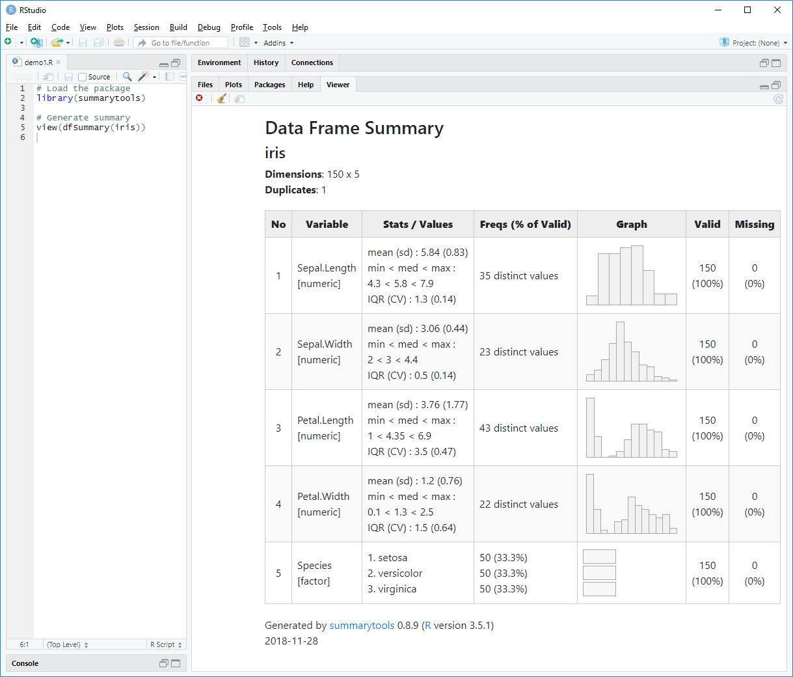
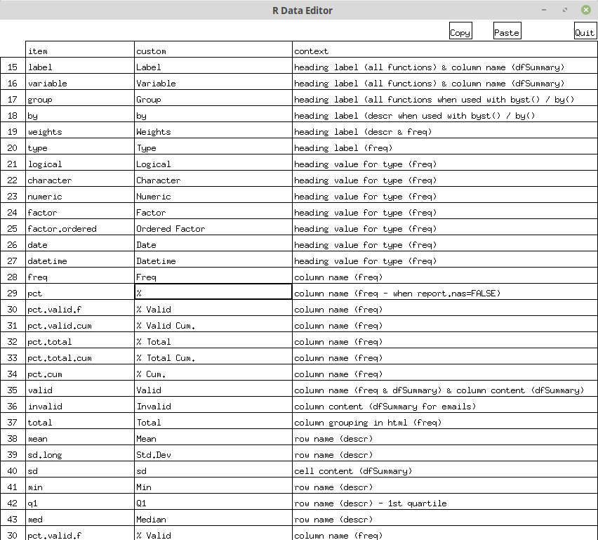

```{r setup, include=FALSE}
library(knitr)
opts_chunk$set(comment = NA, prompt = FALSE, cache = FALSE, results = 'asis')
library(summarytools)
st_options(plain.ascii = FALSE,
           style = "rmarkdown",
           footnote = NA,
           subtitle.emphasis = FALSE)
```

```{r, echo=FALSE}
st_css()
```

**summarytools** provides tools to *neatly and quickly summarize data*. 
It can also make _R_ a little easier to learn and use, especially for data
cleaning and preliminary analysis. Four functions are at the core of the
package:

  - `freq()` : **frequency tables** with proportions, cumulative
    proportions and missing data information
  - `ctable()` : **cross-tabulations** between two factors or any
    discrete data, with total, rows or columns proportions, as well
    as marginal totals
  - `descr()` : **descriptive (univariate) statistics** for numerical data
  - `dfSummary()` : Extensive **data frame summaries** that facilitate
    data cleaning and firsthand evaluation

An emphasis has been put on both _what_ and _how_ results are presented, so that
the package can serve both as an exploration _and_ reporting tool, used on its 
own for minimal reports, or with other sets of tools such as 
[rmarkdown](http://rmarkdown.rstudio.com/), and [knitr](https://yihui.name/knitr/).

**Building on the strengths of [pander](https://github.com/Rapporter/pander) and
[htmltools](https://CRAN.R-project.org/package=htmltools)**, the 
outputs produced by **summarytools** can be:

  - Displayed in plain text in the *R* console (default behaviour)
  - Used in *Rmarkdown* documents and *knitted* along with other text and
    *R* output
  - Written to _html_ files that open up in
    [*RStudio*](https://www.rstudio.com/)’s Viewer or in the default
    browser
  - Written to plain or *markdown* text files

It is also possible to include **summarytools** functions in *Shiny apps*.

### Latest Improvements

Version 0.9 brought **many** changes and improvements to **summarytools**. 
A summary of those changes can be found [near the end of this vignette](#changes).
Changes specific to the latest release can be found in the package's _NEWS_ file
located in the _summarytools_ directory inside your R library's, and also 
available using `news(package = "summarytools")` in R versions 3.6.0 and above.

### This Vignette's Setup

Since this vignette was created using _Rmarkdown_, we've set some global options
that are appropriate for this format and which avoid redundancy in the code. 
Here's what the setup chunk looks like (further explanations will be given 
below):

```
# ```{r setup, include=FALSE}
# library(knitr)
# opts_chunk$set(results = 'asis',      # This is essential (can also be set at the chunk-level)
#                comment = NA, 
#                prompt = FALSE, 
#                cache = FALSE)
#
# library(summarytools)
# st_options(plain.ascii = FALSE,       # This is very handy in all Rmd documents
#            style = "rmarkdown"        # This too
#            footnote = NA,             # Avoids footnotes which would clutter the results
#            subtitle.emphasis = FALSE  # This is a setting to experiment with - according to
# )                                     # the theme used, it might improve the headings' 
#                                       # layout
# ```

# ```{r, echo=FALSE}
# st_css()                              # This is a must; without it, expect odd layout,
# ```                                   # especially with dfSummary()
```
<br/>


## The Four Core Functions

## 1 - freq() : Frequency Tables

The `freq()` function generates a table of frequencies with counts and
proportions.

```{r}
library(summarytools)
freq(iris$Species, plain.ascii = FALSE, style = "rmarkdown")
```

We've added the `plain.ascii` and `style` arguments for this first example;
however, since we have set these options globally using `st_options()`, they are not 
really needed. For this reason, we will not include them from hereon.

If we do not worry about missing data, we can set `report.nas = FALSE`:

```{r}
freq(iris$Species, report.nas = FALSE, headings = FALSE)
```

We can simplify the results further and omit the _Totals_ row by specifying 
`totals = FALSE`, as well as omit the _cumulative_ rows by setting
`cumul = FALSE`.

```{r}
freq(iris$Species, report.nas = FALSE, totals = FALSE,
     cumul = FALSE, style = "rmarkdown", headings = FALSE)
```

To get familiar with the various output styles, try different values for 
`style` -- “simple”, “rmarkdown” or “grid”, and see how this affects the
results in the console.

#### Subsetting Rows in Frequency Tables

The "rows" argument allows subsetting the resulting frequency table; we can 
use it in 3 different ways: 

  - To select rows by position, we use a numerical vector; `rows = 1:10` will 
    show the frequencies for the first 10 values only
  - To select rows by name, we either use
    + a character vector specifying all desired values (row names)
    + a single character string to be used as a regular expression; only the
      matching values will be displayed
    
Used in combination with the "order" argument, this can be quite practical. 
Say we have a character variable containing many distinct values and wish to
know which ones are the 10 most frequent. To achieve this, we would simply 
use `order = "freq"` along with `rows = 1:5`.

#### Generating Several Frequency Tables at Once

There is more than one way to do this, but the best approach is to simply pass
the data frame object (subsetted if needed) to `freq()`: (results not shown)

```{r, eval=FALSE}
freq(tobacco[ ,c("gender", "age.gr", "smoker")])
```

We can without fear pass a whole data frame to `freq()`; it will figure out
which variables to ignore (numerical variables having many distinct
values).

## 2 - ctable() : Cross-Tabulations

We’ll now use a sample data frame called *tobacco*, which is included in 
**summarytools**. We want to cross-tabulate two categorical variables:
`smoker` and `diseased`.

Since *markdown* does not support multiline headings, we’ll show a 
rendered _html_ version of the results:

```{r}
print(ctable(tobacco$smoker, tobacco$diseased, prop = "r"), method = "render")
```

By default, `ctable()` shows _row proportions_.
To show column or total proportions, use `prop = "c"` or `prop = "t"`,
respectively. To omit proportions, use `prop = "n"`.

In the next example, we'll create a simple “2 x 2” table 
(no proportions, no totals):

```{r}
with(tobacco, 
     print(ctable(smoker, diseased, prop = 'n', totals = FALSE),
           headings = FALSE, method = "render"))
```

#### Chi-square results

To display chi-square results below the table, set the "chisq" parameter to
`TRUE`. This time, instead of `with()`, we'll use the `%$%` operator from the
**magrittr** package, which works in a very similar fashion.

```{r}
library(magrittr)
tobacco %$% 
  ctable(gender, smoker, chisq = TRUE, headings = FALSE) %>%
  print(method = "render")
```

Note that a warning will be issued when at least one _expected_ cell counts 
is lower than 5.

## 3 - descr() : Descriptive Univariate Stats

The `descr()` function generates common central tendency statistics and
measures of dispersion for numerical data. It can handle single vectors
as well as data frames, in which case it will ignore non-numerical
columns (and display a message to that effect).

```{r}
descr(iris, style = "rmarkdown")
```

### Transposing, Selecting Statistics

If your eyes/brain prefer seeing things the other way around, just use
`transpose = TRUE`. Here, we also select only the statistics we wish to
see, and specify `headings = FALSE` to avoid reprinting the same
information as above.

We specify the stats we wish to report with the `stats` argument, which
also accepts values “all”, “fivenum”, and “common”. See `?descr` for 
a complete list of available statistics.

```{r}
descr(iris, stats = "common", transpose = TRUE, headings = FALSE)
```

## 4 - dfSummary() : Data Frame Summaries

`dfSummary()` collects information about all variables in a data frame and
displays it in a single legible table.

To generate a summary report and have it displayed in RStudio’s 
Viewer pane (or in the default Web browser if working outside RStudio),
we simply do as follows:

```{r, eval=FALSE}
library(summarytools)
view(dfSummary(iris))
```


Of course, it is also possible to use `dfSummary()` in *Rmarkdown* documents. It
is usually a good idea to exclude a column or two, otherwise the table might be a
bit too wide. For instance, since the _Valid_ and _NA_ columns are redundant, 
we can drop one of them.

```{r, eval=FALSE}
dfSummary(tobacco, plain.ascii = FALSE, style = "grid", 
          graph.magnif = 0.75, valid.col = FALSE, tmp.img.dir = "/tmp")
```


While rendering _html_ tables with `view()` doesn't require it, here it is
essential to specify `tmp.img.dir`. We'll explain why [further below](#tmp-img-dir).

## Tidy Tables With tb()
When generating `freq()` or `descr()` tables, it is possible to turn the
results into "tidy" tables with the use of the `tb()` function (think of
_tb_ as a diminutive for _tibble_). For example:

```{r, results='markup'}
library(magrittr)
iris %>% descr(stats = "common") %>% tb()
iris$Species %>% freq(cumul = FALSE, report.nas = FALSE) %>% tb()
```

By definition, no total rows are part of _tidy_ tables, and row.names are
converted to regular columns. For now, `tb()` doesn't handle split-group
tables, but it is certainly in store for a future release of **summarytools**.

## The print() and view() Functions

**summarytools** has a generic `print` method, `print.summarytools()`. By
default, its `method` argument is set to “pander”. One of the ways in
which `view()` is useful is that we can use it to easily display _html_
outputs in *RStudio*’s Viewer. The `view()` function simply acts as a wrapper 
around `print.summarytools()`, specifying `method = 'viewer'`. When used outside 
*RStudio*, `method` falls back to “browser” and the report is shown in the
system’s default browser.

## Using stby() to Ventilate Results

We can use `stby()` the same way as *R*’s base function `by()` with the four
core **summarytools** functions. This returns a list-type object
containing as many elements as there are categories in the grouping variable.

**Why not just use `by()`?** The reason is that `by()` creates objects of
class "by()", which have a dedicated `print()` method conflicting with
summarytools' way of printing list-type objects. Since `print.by()` can't be
redefined (as of CRAN policies), the sensible solution was to introduce a 
function that is essentially a clone of `by()`, except that the objects it
creates have the class "stby", allowing the desired flexibility.

Using the _iris_ data frame, we will now display descriptive statistics
by Species.

```{r}
(iris_stats_by_species <- stby(data = iris, 
                               INDICES = iris$Species, 
                               FUN = descr, stats = c("mean", "sd", "min", "med", "max"), 
                               transpose = TRUE))
```

To see an _html_ version of these results, we simply use `view()` (also
possible is to use `print()` with `method = "viewer"`): (results not shown)

```{r, eval=FALSE}
view(iris_stats_by_species)
# or
print(iris_stats_by_species, method = "viewer")
```

A special situation occurs when we want grouped statistics 
_for one variable only_. Instead of showing several tables, each having one 
column, **summarytools** assembles everything into a 
single table:

```{r}
data(tobacco)
with(tobacco, stby(BMI, age.gr, descr, 
                   stats = c("mean", "sd", "min", "med", "max")))
```

**The transposed version looks like this:**

```{r, echo=FALSE}
BMI_by_age <- with(tobacco, 
                   stby(BMI, age.gr, descr, transpose = TRUE,
                        stats = c("mean", "sd", "min", "med", "max")))
print(BMI_by_age, headings = FALSE)
```

### Using stby() With ctable()

This is a little trickier -- the working syntax is as follows:

```{r, eval=FALSE}
stby(list(x = tobacco$smoker, y = tobacco$diseased), tobacco$gender, ctable)
# or equivalently
with(tobacco, stby(list(x = smoker, y = diseased), gender, ctable))
```

## Using summarytools in Rmarkdown Documents

As we have seen, **summarytools** can generate both text/_markdown_ and _html_
results. Both types of outputs can be used in Rmarkdown documents. The vignette
[Recommendations for Using summarytools With Rmarkdown](https://cran.r-project.org/package=summarytools/vignettes/Recommendations-rmarkdown.html)
provides good guidelines, but here are a few tips to get started:

 - Always set the `knitr` chunk option `results = 'asis'`. You can do
   this on a chunk-by-chunk basis, but it is easier to just set it globally
   in a "setup" chunk:

```{r, eval=FALSE, tidy=FALSE}
    knitr::opts_chunk$set(echo = TRUE, results = 'asis')
```

\ \ \ \ \ \ \ \ \ \ Refer to [this page](https://yihui.name/knitr/options/) for
more _knitr_'s options.

  - To get better results when generating _html_ output with `method = 'render'`,
    set up your _.Rmd_ document so that it includes **summarytools**’ css. The
    `st_css()` function makes this very easy.

#### Initial Setup -- Example

````
# ---
# title: "RMarkdown using summarytools"
# output: html_document
# ---
#
# ```{r setup, include=FALSE}
# library(knitr)
# opts_chunk$set(comment = NA, prompt = FALSE, cache = FALSE, results = 'asis')
# library(summarytools)
# st_options(plain.ascii = FALSE,          # This is a must in Rmd documents
#            style = "rmarkdown",          # idem
#            dfSummary.varnumbers = FALSE, # This keeps results narrow enough
#            dfSummary.valid.col = FALSE)  # idem
#```
#
# ```{r, echo=FALSE}
# st_css()
# ```
````

Since `results = 'asis'` can conflict with other packages' way of generating
results, it is sometimes best to use it for individual chunks only.

### Managing Lengthy dfSummary() Outputs in Rmarkdown Documents

For data frames containing numerous variables, we can use the `max.tbl.height`
argument to wrap the results in a scrollable window having the specified
height, in pixels. For instance:

```{r}
print(dfSummary(tobacco, valid.col = FALSE, graph.magnif = 0.75), 
      max.tbl.height = 300, method = "render")
```


## Writing Output to Files

We can use the `file` argument with `print()` or `view()` to indicate that we
want to save the results in a file, be it _html_, _Rmd_, _md_, or just plain
text (_txt_). The file extension indicates to **summarytools** what type of file
should be generated.

```{r, eval=FALSE}
view(iris_stats_by_species, file = "~/iris_stats_by_species.html")
```

### Appending Output Files

The `append` argument allows adding content to existing files generated by
**summarytools**. This is useful if you want to include several statistical
tables in a single file. It is a quick alternative to creating an _.Rmd_ document.

## Global options

The following options can be set with `st_options()`:

### General Options

| Option name               | Default   | Note                                            |
| ------------------------: | --------: | :---------------------------------------------- |
| style                     | “simple”  | Set to “rmarkdown” in .Rmd documents            |
| plain.ascii               |    TRUE   | Set to FALSE in .Rmd documents                  |
| round.digits              |       2   | Number of decimals to show                      |
| headings                  |    TRUE   | Formerly “omit.headings”                        |
| footnote                  | “default” | Personalize, or set to NA to omit               |
| display.labels            |    TRUE   | Show variable / data frame labels in headings   |
| bootstrap.css (*)         |    TRUE   | Include Bootstrap 4 css in _html_ outputs       |
| custom.css                |      NA   | Path to your own css file                       |
| escape.pipe               |   FALSE   | Useful for some Pandoc conversions              |
| subtitle.emphasis         |    TRUE   | Controls headings formatting                    |
| lang                      |   “en”    | Language (always 2-letter, lowercase)           |

(*) Set to FALSE in Shiny apps

### Function-Specific Options

| Option name            |  Default | Note                                     |
| ---------------------: | -------: | :--------------------------------------- |
| freq.totals            |   TRUE   | Display totals row in freq()             |
| freq.report.nas        |   TRUE   | Display <NA> row and “valid” columns     |
| ctable.prop            |    “r”   | Display **r**ow proportions by default   |
| ctable.totals          |   TRUE   | Show marginal totals                     |
| descr.stats            |   “all”  | “fivenum”, “common” or vector of stats   |
| descr.transpose        |  FALSE   |                                          |
| descr.silent           |  FALSE   | Hide console messages                    |
| dfSummary.varnumbers   |   TRUE   | Show variable numbers in 1st col.        |
| dfSummary.labels.col   |   TRUE   | Show variable labels when present        |
| dfSummary.graph.col    |   TRUE   | Show graphs                              |
| dfSummary.valid.col    |   TRUE   | Include the Valid column in the output   |
| dfSummary.na.col       |   TRUE   | Include the Missing column in the output |
| dfSummary.graph.magnif |      1   | Zoom factor for bar plots and histograms |
| dfSummary.silent       |  FALSE   | Hide console messages                    |
| tmp.img.dir            |     NA   | Directory to store [temporary images](#tmp-img-dir) |


#### Examples

```{r, eval=FALSE}
st_options()                      # display all global options values
st_options('round.digits')        # display the value of a specific option
st_options(style = 'rmarkdown')   # change one or several options' values
st_options(footnote = NA)         # Turn off the footnote on all outputs.
                                  # This option was used prior to generating
                                  # the present document.
```

## Overriding formatting attributes

When a **summarytools** object is created, its formatting attributes are
stored within it. However, you can override most of them when using the
`print()` method or the `view()` function.

### Overriding Function-Specific Arguments


| Argument       | freq   | ctable | descr | dfSummary |
| -------------: | :----: | :----: | :---: | :-------: |
| style          |   x    |   x    |   x   |     x     |
| round.digits   |   x    |   x    |   x   |           |
| plain.ascii    |   x    |   x    |   x   |     x     |
| justify        |   x    |   x    |   x   |     x     |
| headings       |   x    |   x    |   x   |     x     |
| display.labels |   x    |   x    |   x   |     x     |
| varnumbers     |        |        |       |     x     |
| labels.col     |        |        |       |     x     |
| graph.col      |        |        |       |     x     |
| valid.col      |        |        |       |     x     |
| na.col         |        |        |       |     x     |
| col.widths     |        |        |       |     x     |
| totals         |   x    |   x    |       |           |
| report.nas     |   x    |        |       |           |
| display.type   |   x    |        |       |           |
| missing        |   x    |        |       |           |
| split.tables   |   x    |   x    |   x   |     x     |
| caption        |   x    |   x    |   x   |     x     |


### Overriding Headings Content

| Argument           | freq   | ctable | descr | dfSummary |
| -----------------: | :----: | :----: | :---: | :-------: |
| Data.frame         |   x    |   x    |   x   |     x     |
| Data.frame.label   |   x    |   x    |   x   |     x     |
| Variable           |   x    |   x    |   x   |           |
| Variable.label     |   x    |   x    |   x   |           |
| Group              |   x    |   x    |   x   |     x     |
| date               |   x    |   x    |   x   |     x     |
| Weights            |   x    |        |   x   |           |
| Data.type          |   x    |        |       |           |
| Row.variable       |        |   x    |       |           |
| Col.variable       |        |   x    |       |           |


#### Example 

Here's an example in which we override 3 function-specific arguments, and one
element of the heading:

```{r}
(age_stats <- freq(tobacco$age.gr)) 
print(age_stats, report.nas = FALSE, totals = FALSE, display.type = FALSE,
      Variable.label = "Age Group")
```

Note that the original attributes are still part of the _age\_stats_ object,
left unchanged.

## Order of Priority for Options / Parameters

1.  Options overridden explicitly in `print()` or `view()` have
    precedence
2.  Options specified as explicit arguments to `freq() / ctable() /
    descr() / dfSummary()` come second
3.  Global options set with `st_options` come third

## Customizing looks with CSS

**summarytools** uses *RStudio*’s
[htmltools package](https://CRAN.R-project.org/package=htmltools)
and version 4 of [Bootstrap](https://getbootstrap.com/)’s cascading
stylesheets.

It is possible to include your own _css_ if you wish to customize the
look of the output tables. See `?print.summarytools` for all the details,
but here is a quick example.

Say you need to make the font size really really small. For this,
you would create a _.css_ file - let’s call it “custom.css” -
containing a class definition such as the following:

```css
.tiny-text {
  font-size: 8px;
}
```
Then, to apply it to a **summarytools** object and display it in your
browser:

```{r, eval=FALSE}
view(dfSummary(tobacco), custom.css = 'path/to/custom.css', 
     table.classes = 'tiny-text')
```

To display a smaller table that is not **that** small, you can use the
**provided css class `st-small`**.

## Working with _Shiny_ apps

To include **summarytools** functions in _Shiny_ apps, it is recommended that 
you:

 - set `bootstrap.css = FALSE` to avoid interacting with the app's layout  
 - omit headings by setting the global option `headings = FALSE`
 - adjust the size of the graphs in `dfSummary()` using the `dfSummary.graph.magnif`
   global option
 - if `dfSummary()` outputs are too wide, try omitting a column or two
   (`valid.col` and `varnumbers`, for instance)
 - if needed, set the column widths manually with the `col.widths` parameter of the 
   `print()` method or the `view()` function
 
```{r, eval=FALSE}
print(dfSummary(somedata, graph.magnif = 0.8), 
      method = 'render',
      headings = FALSE,
      bootstrap.css = FALSE)
```

## Graphs in Markdown dfSummaries {#tmp-img-dir}

When generating _markdown_ (as opposed to _html_) summaries in an _.Rmd_ document,
three elements are needed to display proper _png_ graphs:

  1 - `plain.ascii` is FALSE  
  2 - `style` is "grid"  
  3 - `tmp.img.dir` is defined  

Why the third element? Although _R_ makes it really easy to 
create temporary files and directories, they do have long pathnames,
especially on Windows. Combine this with the fact that Pandoc currently
determines the final (rendered) column widths by counting characters, 
including those of pathnames pointing to images. What we get is... some
issues of proportion (!). 

At this time, there seems to be only one solution around this problem:
cut down on characters in pathnames. So instead of this:
```
+-----------+-------------------------------------------------------------------------+---------+
| Variable  | Graph                                                                   | Valid   |
+===========+=========================================================================+=========+
| gender\   |  | 978\    |
| [factor]  |                                                                         | (97.8%) |
+----+---------------+----------------------------------------------------------------+---------+
```

...we aim for this:
```
+---------------+----------------------+---------+
| Variable      | Graph                | Valid   |
+===============+======================+=========+
| gender\       |  | 978\    |
| [factor]      |                      | (97.8%) |
+---------------+----------------------+---------+
```

Now CRAN policies are really strict when it comes to writing content in 
the user directories, or anywhere outside _R's temporary zone_ (for good 
reasons). So we need to let the users set this location themselves,
therefore implicitly consenting to content being written outside _R's 
temporary zone_.

On Mac OS and Linux, using "/tmp" makes a lot of sense: it's short, and
it's self-cleaning. On Windows, there is no such convenient directory, so
we need to pick one -- be it absolute ("/tmp") or relative ("img",
or simply "."). Two things are to be kept in mind: it needs to be short
(5 characters max) and we need to clean it up manually.

## Translations

It is now possible to switch the language used in the outputs. So far, the 
following languages are available, thanks to the R community's efforts: 
French (*fr*), Portuguese (*pt*), Russian (*ru*), Spanish (*es*), and 
Turkish (*tr*).

### Switching Languages

To switch languages, simply use 

```{r}
st_options(lang = "fr")
```

Any function will now produce outputs using that language:

```{r}
freq(iris$Species)
```

The language used for producing the object is stored within it as an attribute.
This is to avoid problems when switching languages between the moment the 
object is stored, and the moment at which it is printed.

### Non-UTF-8 Locales

On most Windows systems, it will be necessary to change the `LC_CTYPE` element 
of the locale settings if the character set is not included in the current 
locale. For instance, in order to get good results -- or rather, any results at 
all -- printing in the console with the Russian language, we'll need to do 
this:

```{r, eval = FALSE}
Sys.setlocale("LC_CTYPE", "russian")
st_options(lang = 'ru')
```

Then, to go back to default settings:

```{r, results='hide'}
Sys.setlocale("LC_CTYPE", "")
st_options(lang = "en")
```

### Defining and Using Custom Translations

With the new function `use_custom_lang()`, you can add your own set of 
translations. For this, create a copy of the _language_template.csv_ file 
located in the _summarytools/includes_ of your package library, or download it
from [this location](https://raw.githubusercontent.com/dcomtois/summarytools/master/translations/language_template.csv).

After you're done translating the +/- 70 items, simply call the 
`use_custom_lang()` function, giving it as sole argument the path to the _csv_
file you've just created. Note that such custom translations will not persist 
across R sessions. This means that you should always have handy this _csv_ file 
if you're to print objects created with it. 

### Defining Specific Keywords

Sometimes, all you might want to do is change just a few keywords -- say you
would rather have "N" instead of "Freq" in the title row of `freq()` tables. No
need to create a full custom language for that. Rather, use `define_keywords()`.
Calling this function without any arguments will bring up, on systems that
support graphical devices (the vast majority, that is), an editable window
allowing the modify only the desired items. 



After closing the edit window, you will be offered to export the resulting
"custom language" into a _.csv_ file that can be imported later on with
`use_custom_lang()`.

Note that it is also possible to define one or several keywords using function
arguments. For the list of all possible keywords to define, see `?define_keywords`. For instance:

```{r, eval=FALSE}
define_keywords(freq = "N")
```


## Changes and Improvements Since Version 0.9 {#changes}

As stated earlier, version 0.9 brought **many** improvements
to **summarytools**. Here are the key elements:

 - **Translations**
 - **Improved printing of list objects**
   + Objects of class “stby” are automatically printed in the console with
     optimal results; no more need for `view(x, method = "pander")`;
     simply use `stby()` instead of `by()`
   + Regular lists containing **summarytools** objects can also be printed with
     optimal results simply by calling `print(x)` (as opposed to “stby” objects,
     their automatic printing will **not** be optimal; that being said, `freq()`
     now accepts data frames as its first argument, so the need for `lapply()`
     is greatly diminished)
 - **Easier management of global settings with `st_options()`**
   + `st_options()` now has as many parameters as there are
     options to set, making it possible to set all options 
     with only one function call; legacy way of setting
     options is still supported
   + Several global options were added, with a focus on simplifying 
     *Rmarkdown* document creation
 - **improved magrittr** operators support (`%>%`, `%$%`)
 - **Changes to `freq()`**
   + As mentioned earlier, the function now accepts data frames as its main 
     argument; this makes practically obsolete the use of `lapply()` with it
   + Improved outputs when using `stby()`
 - **Changes to `ctable()`**
   + Fully supports `stby()`
   + Improved number alignment
 - **Changes to `descr()`**
   + For the `stats` argument, Values “fivenum” and “common” are now allowed,
     the latter representing the collection of _mean_, _sd_, _min_, _med_,
     _max_, _n.valid_, and _pct.valid_
   + Improved outputs when using `stby()` 
   + The variable used for weights (if any) is removed automatically from the
     data so no stats are produced for it
 - **Changes to `dfSummary()`**
   + Now fully compatible with _Rmarkdown_ with its _png_ graphs
   + Number of columns is included in the heading section
   + Number of duplicated rows is also shown in the heading section
   + Bar plots now more accurately reflect counts, as they are not stretched
     across table cells (this allows comparison of frequencies across 
     variables)
   + Columns with particular content (unary/binary, integer sequences, UPC/EAN
     codes) are treated differently; more relevant information is displayed,
     while irrelevant information is hidden
   + For _html_ outputs, a new parameter `col.widths` can be used to set the
     width of the resulting table's columns; this addresses an issue
     with some graphs not being shown at the desired magnification level 
     (although much effort has been put into improving this as well)
   + `max.tbl.height` parameter is added, allowing lengthy summaries to
     be shown in a scrollable window

### Other Notable Changes

 - The `omit.headings` parameter has been replaced by the more straightforward
   (and still boolean) `headings`. `omit.heandings` is still supported 
   but will be deprecated in future releases
 - Because it was subject to errors, the _Rows Subset_ heading element
   has been removed. If there is a strong need for it, I can bring it back in a 
   future release (just let me known by email or on GitHub if you'd like to have
   it back)
 - Under the hood, much has been going on; the lengthier functions have been
   split into more manageable parts, and several normalizing operations were
   performed, facilitating maintenance and improving code readability
 - The `tb()` function turns results from `freq()` and `descr()` into 
   _tidy tibbles_
   
### Backward Compatibility

No changes break backward compatibility, but at least one legacy feature will
disappear in some further release. Namely, the boolean parameter `omit.headings`, 
which has been replaced by the more straightforward `headings`. For now, a 
message is shown whenever the "old" parameter name is used, encouraging users
to transition to the newer one.

## Stay Up-to-date

Check out the [GitHub project's page](https://github.com/dcomtois/summarytools) - 
from there you can see the latest updates and also submit feature requests.

For a preview of what's coming in the next release, have a look at the 
[development branch](https://github.com/dcomtois/summarytools/tree/dev-current).

## Final notes

The package comes with no guarantees. It is a work in progress and
feedback / feature requests are welcome. Just send an email to
dominic.comtois@gmail.com, or open an
[Issue on GitHub](https://github.com/dcomtois/summarytools/issues) if you find a
bug or wish to submit a feature request.
