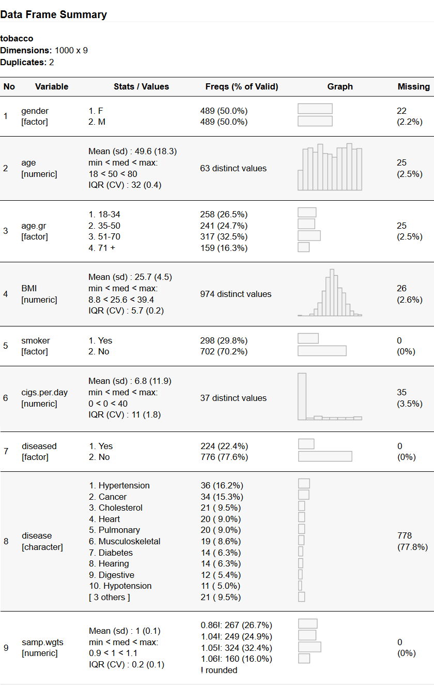

```{r setup, include=FALSE}
library(knitr)
opts_chunk$set(comment = NA, 
               prompt  = FALSE,
               cache   = FALSE,
               echo    = TRUE,
               results = 'asis')
library(summarytools)
st_options(bootstrap.css     = FALSE,       # Already part of the theme so no need for it
           plain.ascii       = FALSE,       # One of the essential settings
           style             = "rmarkdown", # Idem.
           dfSummary.silent  = TRUE,        # Suppresses messages about temporary files
           footnote          = NA,          # Keeping the results minimalist
           descr.silent      = TRUE,        # To avoid messages when building / checking
           subtitle.emphasis = FALSE)       # For the vignette theme, this gives better results.
                                            # For other themes, using TRUE might be preferable.
```

```{r, echo=FALSE}
st_css(main = TRUE, global = TRUE)
```

# 1. Introduction

This document mainly contains examples showing how best to use
**summarytools** in *R Markdown* documents. For a more in-depth view
of the package's features, please see `vignette("introduction", "summarytools")` 
- the online version can be found 
[here](https://cran.r-project.org/package=summarytools/vignettes/introduction.html). 

## 1.1 Methods vs Styles 

Every time we display **summarytools** objects with `print()`, `view()`,
or `stview()`, we pick -- explicitly or not -- one of several display methods.
Possible display methods are: *pander*, *render*, *viewer*, and *browser*. 

:::infobox
**Disambiguation**  

To avoid any confusion, here is a small digression on the word *method*. 
It is a broad term which is also used in the OOP (object oriented programming) 
lexicon to describe a special kind of function that is linked to a specific 
class of objects. In R, the `print()` function is called a *generic* function.
It is generic because it takes and handles many type of objects as an input.
According to the class (or classes) of the object, it will dispatch the object
to the particular *print method* dedicated to its class. In that sense, the
`print.summarytools()` function *is itself a method*: objects of class
"summarytools" are being dispatched to it by the
**generic `print()` function**.
:::

In this document, the term *method* refers to the *display* method -- **not**
the *OOP* concept. It is one of the parameters for `print.summarytools()`,
`view()`, and `stview()`. Since methods *viewer* and *browser* are mostly
meant for interactive work and rely on the same underlying code as *render*,
we will assume for the purpose of this document that there are really only two
methods: *pander* and *render*.

### Only the *pander* Method Uses Styles  

The *pander* method is used by default when results are automatically printed 
to the console, or when we use `print()` without an explicit `method`
argument. 

The *style* parameter is communicated to **pander** (see `?pander::pander`
or visit its [GitHub page](https://github.com/Rapporter/pander) to learn more
on this very useful package).

<table><tr><td></td>
<td>When we use any of the *viewer*, *browser*, or *render* methods, the 
package rather uses **htmltools** to generate results; any specified *styles*
are thus ignored.
</td></tr></table> 

### **summarytools** styles are **pander** styles

Available styles are the ones supported by **pander**: 

- simple (default, used mainly in R console)  
- rmarkdown (used by all core functions except `dfSummary()`)  
- grid (mainly used with `dfSummary()`)  
- multiline (can be used with `dfSummary()` if you want ASCII graphs only)  
- jira (recent addition, not thoroughly tested)  


## 1.2 General Guidelines  

**Always** set **results='asis'** either explicitly on a chunk-by-chunk bases
or by including `opts_chunk$set(results = 'asis')` in your setup chunk.

Also, don't forget to specify **`plain.ascii = FALSE`** in all function calls
using the *pander* method. It is advised to set this option, as well as the 
`style` option in the setup chunk:

```{r, eval=FALSE}
st_options(plain.ascii = FALSE, style = "rmarkdown")
```

or include `st_options(plain.ascii = FALSE)` in
your setup chunk.  

<table><tr><td></td>
<td>If you get repeated, unhelpful warnings, use chunk options `message = FALSE` 
and/or `warning = FALSE`.
</td></tr></table> 

The following table indicates which method / style is better suited for each 
**summarytools** function in the context of R Markdown documents:

| Function    | render method | pander method | pander style |
|:------------|:-------------:|:-------------:|:-------------|
| freq()      | &#10003;      | &#10003;      | rmarkdown    |
| ctable()    | &#10003;      | Sub-optimal   | rmarkdown    |
| descr()     | &#10003;      | &#10003;      | rmarkdown    |
| dfSummary() | &#10003;      | &#10003;      | grid         |

**Recommended Style When Using *pander* method** 

For `freq()`, `descr()`, and `ctable()`, _rmarkdown_ style is recommended.
For `dfSummary()`, _grid_ is recommended. Note that 'multiline' can also
be used, but only ASCII graphs will be displayed.
 
Starting with `freq()`, we'll now review the recommended methods and styles to 
get satisfying results in *R Markdown* documents. 

--------------------------------------------------------------------------------

# 2. Using freq() in R Markdown

`freq()` is best used with `style = 'rmarkdown'; html rendering is also 
possible.

## 2.1 Pander Style for freq()

With `method="pander"`, "rmarkdown" is the easy winner.

```{r}
freq(tobacco$gender, plain.ascii = FALSE, style = 'rmarkdown')
```

## 2.2 HTML Rendering for freq()  

There are rarely any problems when using the *render* method to display
`freq()` results.

```{r}
print(freq(tobacco$gender), method = 'render')
```

If you find the table too large, you can use `table.classes = 'st-small'`:

```{r, message=FALSE}
print(descr(tobacco), method = 'render', table.classes = 'st-small')
```

--------------------------------------------------------------------------------

<a href="#top">Back to top</a>

# 3. Using ctable() in R Markdown 

## 3.1 Rmarkdown Style for ctable()  

Tables with heading spanning over 2 rows are not fully supported in markdown 
(yet), but the result is getting close to acceptable. This, however, is not
true for all themes. That is why the rendering method is preferred.

```{r}
ctable(tobacco$gender, 
       tobacco$smoker,
       plain.ascii = FALSE, 
       style = 'rmarkdown')
```


## 3.2 HTML Rendering for ctable()  

For best results, use this method.

```{r ctable_html}
print(ctable(tobacco$gender, tobacco$smoker), method = 'render')
```

--------------------------------------------------------------------------------
 
<a href="#top">Back to top</a>
 
# 4. Using descr() in R Markdown 
`descr()` gives good results with both `style = 'rmarkdown'` and HTML rendering.

## 4.1 Rmarkdown Style for descr()  
```{r}
descr(tobacco, plain.ascii = FALSE, style = 'rmarkdown')
```

## 4.2 HTML Rendering for descr()  

We'll use table.classes = 'st-small' to show how it affects the table's size,
compared to the `freq()` table rendered earlier.

We'll also use `message = FALSE` as chunk option to avoid the message saying
that non-numerical variables have been ignored.

```{r, message=FALSE}
print(descr(tobacco), method = 'render', table.classes = 'st-small')
```
 
--------------------------------------------------------------------------------

<a href="#top">Back to top</a>

# 5. Using dfSummary() in R Markdown 

To get optimal results, whichever method you choose, it is always best to
omit at least 1, and if possible 2 columns from the output. Also, pick
carefully the value of the `graph.magnig` parameter.

## 5.1 Grid Style for dfSummary() 

Don't forget to specify `plain.ascii = FALSE` (or set it as a global
option with `st_options(plain.ascii = FALSE)`), or you won't get good results.
(Note that to avoid problems when uploading the package, the following is
an imagine, not the actual rendering from this piece of code. This is because
CRAN doesn't allow the writing in /tmp or any other directory, except in R's
temp directory, for good reasons.)

```{r dfs_grid, eval=FALSE}
dfSummary(tobacco, 
          plain.ascii  = FALSE,
          style        = 'grid',
          graph.magnif = 0.85,
          varnumbers = FALSE,
          valid.col    = FALSE,
          tmp.img.dir  = "/tmp")
```



### 4.2 HTML Rendering for dfSummary()  

This method works really well, and not having to specify the `tmp.img.dir`
parameter is a plus.

```{r}
print(dfSummary(tobacco, 
                varnumbers   = FALSE, 
                valid.col    = FALSE, 
                graph.magnif = 0.76),
      method = 'render')
```

## 4.3 Managing Lengthy dfSummary() Outputs in R Markdown Documents

For data frames containing numerous variables, we can use the `max.tbl.height`
argument to wrap the results in a scrollable window having the specified
height, in pixels. 

```{r}
print(dfSummary(tobacco, 
                varnumbers   = FALSE,
                valid.col    = FALSE,
                graph.magnif = 0.76), 
      max.tbl.height = 300,
      method = "render")
```


<table><tr><td></td>
<td>Some users reported getting repeated X11 warnings; those can easily be
avoided by using the following chunk expression:
`{r, results="asis", warning=FALSE}`.
</td></tr></table> 

<a href="#top">Back to top</a>

--------------------------------------------------------------------------------


# 5. Using Other Formatting Packages  

As explained in the introductory vignette, `tb()` can be used to convert
**summarytools** objects created with `freq()` and `descr()` to simple
*tibbles* that packages specialized in table formatting will be able
to process. This is particularly helpful with `stby` objects:

```{r}
library(kableExtra)
library(magrittr)
stby(iris, iris$Species, descr, stats = "fivenum") %>%
  tb() %>%
  kable(format = "html", digits = 2) %>%
  collapse_rows(columns = 1, valign = "top")
```

Using `tb(order = 3)` flips the order of the grouping variable(s) and the
reported variable(s):
```{r}
stby(iris, iris$Species, descr, stats = "fivenum") %>%
  tb(order = 3) %>%
  kable(format = "html", digits = 2) %>%
  collapse_rows(columns = 1, valign = "top")
```

<a href="#top">Back to top</a>

--------------------------------------------------------------------------------


# 6. Including dfSummaries in PDF Documents 

Here is a recipe for including fully formatted data frame summaries in pdf
documents. There is some work involved, but following the instructions given
here should give the expected results.

There are basically two parts to this: first, you must create a preamble *tex*
file. Second, you must indicate in the *YAML* section of your document where to
find this file.

### Included Preamble *Tex* File

This is the \LaTeX content that needs to be included as preamble. You can
either copy this into your own *tex* file, or use the file that is now
included in **summarytools** (as of version 1.0), following the instructions
provided below.

````
\usepackage{graphicx}
\usepackage[export]{adjustbox}
\usepackage{letltxmacro}
\LetLtxMacro{\OldIncludegraphics}{\includegraphics}
\renewcommand{\includegraphics}[2][]{\raisebox{0.5\height}%
  {\OldIncludegraphics[valign=t,#1]{#2}}}
````
 
If you choose to create a *tex* file from the above content, the name of the
file is arbitrary -- you can use whatever name you want. Its 
location is also up to you. I suggest you put it in the same location as your
*Rmd* file.

Along with the `graph.magnif` parameter for `dfSummary()`, you might need to
adjust the 0.5 value used as `raisebox` parameter in the preamble.

### The YAML Section

Your document should start with a *YAML* header like this one, supposing the
preamble *tex* file is in the same location as your *Rmd* document :

```
---
title: "My PDF With Data Frame Summaries"
output: 
  pdf_document: 
    latex_engine: xelatex
    includes:
      in_header: 
      - !expr system.file("includes/fig-valign.tex", package = "summarytools")
---
```

If you need to customize the content of the preamble, then your header will
look something like this:

```
---
title: "My PDF With Data Frame Summaries"
output: 
  pdf_document: 
    latex_engine: xelatex
    includes:
      in_header: fig-valign-modified.tex
---
```

<table><tr><td></td>
<td>The *xelatex* engine option is not mandatory, but there are several
advantages to it. I use it systematically and recommend you do the same.</td>
</tr></table> 


### R Code

Here is an example setup chunk:

````
```{r, message=FALSE}`r ''`  
library(summarytools)
st_options(
  plain.ascii = FALSE, 
  style = "rmarkdown",
  dfSummary.style = "grid",
  dfSummary.valid.col = FALSE,
  dfSummary.graph.magnif = .52,
  subtitle.emphasis = FALSE,
  tmp.img.dir = "/tmp"
)
```
````

And here is a chunk actually creating the summary:

````
```{r, results='asis', message=FALSE}`r ''`  
define_keywords(title.dfSummary = "Data Frame Summary in PDF Format")
dfSummary(tobacco)
```
````

### Remarks

Since we redefined the $\LaTeX$ command `includegraphics`, all images included using
`[](some-image.png)` will be impacted. In some cases this will likely be
problematic. Eventually we will find a more robust solution without such
undesired side-effects. If you are well versed in $\LaTeX$  and think you can
solve this problem, please get in touch.

--------------------------------------------------------------------------------

# 7. This Vignette's Setup  

This vignette uses theme `rmarkdown::html_vignette`. Its *YAML* section
looks like this:

```
---
title: "Summarytools in R Markdown Documents"
author: "Dominic Comtois"
date: "`r Sys.Date()`"
output: 
  html_document:
    fig_caption: false
    toc: true
    toc_depth: 1
    css: assets/vignette.css
vignette: >
  %\VignetteIndexEntry{Summarytools in R Markdown Documents}
  %\VignetteEngine{knitr::rmarkdown}
  %\VignetteEncoding{UTF-8}
  %\VignetteDepends{magrittr}
  %\VignetteDepends{kableExtra}
---
```
<br> 

The *vignette.css* file is copied from the installed **rmarkdown** package's
'templates/html_vignette/resources' directory.
 
 
### Global Options

The following **global options** for **knitr** and **summarytools** have been
set. Other options might also be useful to optimize content, but this is a
good place to start from.

````
```{r setup, include=FALSE}`r ''`
library(knitr)
opts_chunk$set(comment=NA, 
               prompt=FALSE,
               cache=FALSE,
               echo=TRUE,
               results='asis')

st_options(bootstrap.css     = FALSE,       # Already part of the theme 
           plain.ascii       = FALSE,       # Essential setting for Rmd
           style             = "rmarkdown", # Essential setting for Rmd
           dfSummary.silent  = TRUE,        # Hides redundant messages 
           footnote          = NA,          # Keeping the results minimal
           subtitle.emphasis = FALSE)       # For the vignette theme,
                                            # this gives better results. 
                                            # For other themes, using
                                            # TRUE might be preferable.
```
````
 
Finally, **summarytools CSS** has been included in the following manner:

````
```{r, echo=FALSE}`r ''`
st_css(main = TRUE, global = TRUE)
```
````

--------------------------------------------------------------------------------

# 8. Final Notes  

This is by no way a definitive guide; depending on the themes you use, 
you could find that other settings yield better results. If you are looking
to create a _Word_ or a _PDF_ document, you might want to try different
combinations of options. If you find problems with the recommended settings or
if you find better combinations, you are welcome to 
[open an issue on GitHub](https://github.com/dcomtois/summarytools/issues)
to suggest modifications or make a pull request with your own improvements to
this vignette.


<a href="#top">Back to top</a>
